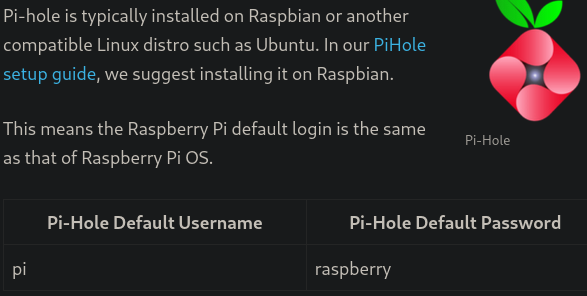

<div style="display: flex; justify-content: center; align-items: center;">

  <div style="margin-right: 20px;">
    
  </div>

  <div style="display: flex; flex-direction: column; text-align: left;">
    <div style="display: flex; align-items: center; margin-bottom: 10px;">
      <strong style="margin-right: 5px;">OS:</strong>
      
      <span style="margin-left: 5px;">Linux</span>
    </div>
    <div style="display: flex; align-items: center; margin-bottom: 10px;">
      <strong style="margin-right: 5px;">Difficulty:</strong>
      <span>Easy</span>
    </div>
    <div style="display: flex; align-items: center; margin-bottom: 10px;">
      <strong style="margin-right: 5px;">Author:</strong>
      <span>Arrexel</span>
    </div>
    <div style="display: flex; align-items: center;">
      <strong style="margin-right: 5px;">Release Date:</strong>
      <span>September 1, 2017</span>
    </div>
  </div>

</div>


## Recon

### Nmap

``` bash
$ nmap -sC -sV 10.10.10.48 -o nmap_scan 
Starting Nmap 7.94SVN ( https://nmap.org ) at 2024-01-14 18:54 WET
Nmap scan report for 10.10.10.48
Host is up (0.060s latency).
Not shown: 996 closed tcp ports (reset)
PORT     STATE SERVICE VERSION
22/tcp   open  ssh     OpenSSH 6.7p1 Debian 5+deb8u3 (protocol 2.0)
| ssh-hostkey: 
|   1024 aa:ef:5c:e0:8e:86:97:82:47:ff:4a:e5:40:18:90:c5 (DSA)
|   2048 e8:c1:9d:c5:43:ab:fe:61:23:3b:d7:e4:af:9b:74:18 (RSA)
|   256 b6:a0:78:38:d0:c8:10:94:8b:44:b2:ea:a0:17:42:2b (ECDSA)
|_  256 4d:68:40:f7:20:c4:e5:52:80:7a:44:38:b8:a2:a7:52 (ED25519)
53/tcp   open  domain  dnsmasq 2.76
| dns-nsid: 
|_  bind.version: dnsmasq-2.76
80/tcp   open  http    lighttpd 1.4.35
|_http-title: Site doesn't have a title (text/html; charset=UTF-8).
|_http-server-header: lighttpd/1.4.35
1033/tcp open  upnp    Platinum UPnP 1.0.5.13 (UPnP/1.0 DLNADOC/1.50)
Service Info: OS: Linux; CPE: cpe:/o:linux:linux_kernel

Service detection performed. Please report any incorrect results at https://nmap.org/submit/ .
Nmap done: 1 IP address (1 host up) scanned in 22.26 seconds
```
| Port | Service |
|:----:|:-------:|
|  22  |   SSH   |
|  53  |   DNS   |
|  80  |   HTTP  |
### Gobuster

``` bash
$ gobuster dir --url http://10.10.10.48/ --wordlist /usr/share/seclists/Discovery/Web-Content/directory-list-2.3-medium.txt           
===============================================================
Gobuster v3.6
by OJ Reeves (@TheColonial) & Christian Mehlmauer (@firefart)
===============================================================
[+] Url:                     http://10.10.10.48/
[+] Method:                  GET
[+] Threads:                 10
[+] Wordlist:                /usr/share/seclists/Discovery/Web-Content/directory-list-2.3-medium.txt
[+] Negative Status codes:   404
[+] User Agent:              gobuster/3.6
[+] Timeout:                 10s
===============================================================
Starting gobuster in directory enumeration mode
===============================================================
/admin                (Status: 301) [Size: 0] [--> http://10.10.10.48/admin/]
```

Found /admin directory


## Pi-Hole

### Default Login

By googling for Pi-hole default login, we can find a username and password



We can use this to ssh into the machine

``` bash
$ ssh pi@10.10.10.48
```


With this we can just get the user flag from the user pi desktop

## PrivEsc

### USB Stick

By running the mount command, we can see that there is a usb device plugged in


If we check it's contents, we get a hint that the files were deleted, but that might be a way to get them back


We can create create an image of the usb stick, and then run strings on it, since the contents were removed but not overwritten.

1 - Create the image


2 - Run strings on the image


Done