<div style="display: flex; justify-content: center; align-items: center;">

  <div style="margin-right: 20px;">
    
  </div>

  <div style="display: flex; flex-direction: column; text-align: left;">
    <div style="display: flex; align-items: center; margin-bottom: 10px;">
      <strong style="margin-right: 5px;">OS: </strong>
      
      <span style="margin-left: 5px;">Linux</span>
    </div>
    <div style="display: flex; align-items: center; margin-bottom: 10px;">
      <strong style="margin-right: 5px;">Difficulty:</strong>
      <span>Easy</span>
    </div>
    <div style="display: flex; align-items: center; margin-bottom: 10px;">
      <strong style="margin-right: 5px;">Author:</strong>
      <span>mrb3n</span>
    </div>
    <div style="display: flex; align-items: center;">
      <strong style="margin-right: 5px;">Release Date:</strong>
      <span>February 17, 2018</span>
    </div>
  </div>

</div>

## Recon

### Nmap Initial Scan

``` bash
$ nmap -sC -sV 10.10.10.79 -o nmap_scan 
Starting Nmap 7.94SVN ( https://nmap.org ) at 2023-12-17 18:42 WET
Nmap scan report for 10.10.10.79
Host is up (0.061s latency).
Not shown: 997 closed tcp ports (reset)
PORT    STATE SERVICE  VERSION
22/tcp  open  ssh      OpenSSH 5.9p1 Debian 5ubuntu1.10 (Ubuntu Linux; protocol 2.0)
| ssh-hostkey: 
|   1024 96:4c:51:42:3c:ba:22:49:20:4d:3e:ec:90:cc:fd:0e (DSA)
|   2048 46:bf:1f:cc:92:4f:1d:a0:42:b3:d2:16:a8:58:31:33 (RSA)
|_  256 e6:2b:25:19:cb:7e:54:cb:0a:b9:ac:16:98:c6:7d:a9 (ECDSA)
80/tcp  open  http     Apache httpd 2.2.22 ((Ubuntu))
|_http-title: Site doesn't have a title (text/html).
|_http-server-header: Apache/2.2.22 (Ubuntu)
443/tcp open  ssl/http Apache httpd 2.2.22 ((Ubuntu))
|_http-server-header: Apache/2.2.22 (Ubuntu)
| ssl-cert: Subject: commonName=valentine.htb/organizationName=valentine.htb/stateOrProvinceName=FL/countryName=US
| Not valid before: 2018-02-06T00:45:25
|_Not valid after:  2019-02-06T00:45:25
|_ssl-date: 2023-12-17T18:42:57+00:00; 0s from scanner time.
|_http-title: Site doesn't have a title (text/html).
Service Info: OS: Linux; CPE: cpe:/o:linux:linux_kernel

Service detection performed. Please report any incorrect results at https://nmap.org/submit/ .
Nmap done: 1 IP address (1 host up) scanned in 17.27 seconds

```

| Port | Service |
|:----:|:-------:|
|  22  |   SSH   |
|  80  |  Apache |
|  443 |  Apache |


### Nmap Script Scan

``` bash
$ nmap --script vuln -p 443 10.10.10.79  
Starting Nmap 7.94SVN ( https://nmap.org ) at 2023-12-17 18:47 WET
Pre-scan script results:
| broadcast-avahi-dos: 
|   Discovered hosts:
|     224.0.0.251
|   After NULL UDP avahi packet DoS (CVE-2011-1002).
|_  Hosts are all up (not vulnerable).

PORT    STATE SERVICE
443/tcp open  https
| ssl-ccs-injection: 
|   VULNERABLE:
|   SSL/TLS MITM vulnerability (CCS Injection)
|     State: VULNERABLE
|     Risk factor: High
|       OpenSSL before 0.9.8za, 1.0.0 before 1.0.0m, and 1.0.1 before 1.0.1h
|       does not properly restrict processing of ChangeCipherSpec messages,
|       which allows man-in-the-middle attackers to trigger use of a zero
|       length master key in certain OpenSSL-to-OpenSSL communications, and
|       consequently hijack sessions or obtain sensitive information, via
|       a crafted TLS handshake, aka the "CCS Injection" vulnerability.
|           
|     References:
|       http://www.cvedetails.com/cve/2014-0224
|       http://www.openssl.org/news/secadv_20140605.txt
|_      https://cve.mitre.org/cgi-bin/cvename.cgi?name=CVE-2014-0224
|_http-csrf: Couldn't find any CSRF vulnerabilities.
| ssl-poodle: 
|   VULNERABLE:
|   SSL POODLE information leak
|     State: VULNERABLE
|     IDs:  CVE:CVE-2014-3566  BID:70574
|           The SSL protocol 3.0, as used in OpenSSL through 1.0.1i and other
|           products, uses nondeterministic CBC padding, which makes it easier
|           for man-in-the-middle attackers to obtain cleartext data via a
|           padding-oracle attack, aka the "POODLE" issue.
|     Disclosure date: 2014-10-14
|     Check results:
|       TLS_RSA_WITH_AES_128_CBC_SHA
|     References:
|       https://cve.mitre.org/cgi-bin/cvename.cgi?name=CVE-2014-3566
|       https://www.securityfocus.com/bid/70574
|       https://www.openssl.org/~bodo/ssl-poodle.pdf
|_      https://www.imperialviolet.org/2014/10/14/poodle.html
| ssl-heartbleed: 
|   VULNERABLE:
|   The Heartbleed Bug is a serious vulnerability in the popular OpenSSL cryptographic software library. It allows for stealing information intended to be protected by SSL/TLS encryption.
|     State: VULNERABLE
|     Risk factor: High
|       OpenSSL versions 1.0.1 and 1.0.2-beta releases (including 1.0.1f and 1.0.2-beta1) of OpenSSL are affected by the Heartbleed bug. The bug allows for reading memory of systems protected by the vulnerable OpenSSL versions and could allow for disclosure of otherwise encrypted confidential information as well as the encryption keys themselves.
|           
|     References:
|       http://www.openssl.org/news/secadv_20140407.txt 
|       http://cvedetails.com/cve/2014-0160/
|_      https://cve.mitre.org/cgi-bin/cvename.cgi?name=CVE-2014-0160
|_http-vuln-cve2017-1001000: ERROR: Script execution failed (use -d to debug)
|_http-dombased-xss: Couldn't find any DOM based XSS.
|_http-stored-xss: Couldn't find any stored XSS vulnerabilities.
| http-enum: 
|   /dev/: Potentially interesting directory w/ listing on 'apache/2.2.22 (ubuntu)'
|_  /index/: Potentially interesting folder

Nmap done: 1 IP address (1 host up) scanned in 77.39 seconds

```

Important vulnerability found
> | ssl-heartbleed: 
|   VULNERABLE:
|   The Heartbleed Bug is a serious vulnerability in the popular OpenSSL cryptographic software library. It allows for stealing information intended to be protected by SSL/TLS encryption.
|     State: VULNERABLE
|     Risk factor: High
|       OpenSSL versions 1.0.1 and 1.0.2-beta releases (including 1.0.1f and 1.0.2-beta1) of OpenSSL are affected by the Heartbleed bug. The bug allows for reading memory of systems protected by the vulnerable OpenSSL versions and could allow for disclosure of otherwise encrypted confidential information as well as the encryption keys themselves.
|           
|     References:
|       http://www.openssl.org/news/secadv_20140407.txt 
|       http://cvedetails.com/cve/2014-0160/
|_      https://cve.mitre.org/cgi-bin/cvename.cgi?name=CVE-2014-0160

We will use this later


### Gobuster

``` bash 
$ gobuster dir --url http://10.10.10.79/ --wordlist /usr/share/seclists/Discovery/Web-Content/common.txt 
===============================================================
Gobuster v3.6
by OJ Reeves (@TheColonial) & Christian Mehlmauer (@firefart)
===============================================================
[+] Url:                     http://10.10.10.79/
[+] Method:                  GET
[+] Threads:                 10
[+] Wordlist:                /usr/share/seclists/Discovery/Web-Content/common.txt
[+] Negative Status codes:   404
[+] User Agent:              gobuster/3.6
[+] Timeout:                 10s
===============================================================
Starting gobuster in directory enumeration mode
===============================================================
/.hta                 (Status: 403) [Size: 283]
/.htaccess            (Status: 403) [Size: 288]
/.htpasswd            (Status: 403) [Size: 288]
/cgi-bin/             (Status: 403) [Size: 287]
/decode               (Status: 200) [Size: 552]
/dev                  (Status: 301) [Size: 308] [--> http://10.10.10.79/dev/]
/encode               (Status: 200) [Size: 554]
/index                (Status: 200) [Size: 38]
/index.php            (Status: 200) [Size: 38]
/server-status        (Status: 403) [Size: 292]
Progress: 4723 / 4724 (99.98%)
===============================================================
Finished
===============================================================

```
Important directory:
>/dev


## Foothold

### Private RSA Key

Looking at the /dev directory, we can see two files
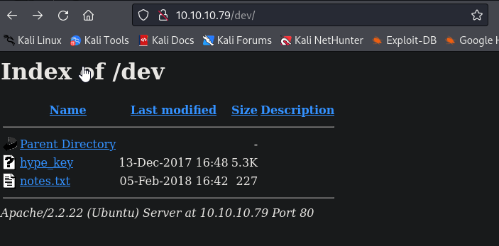

Looking at hype_key, we can see that is is in hex
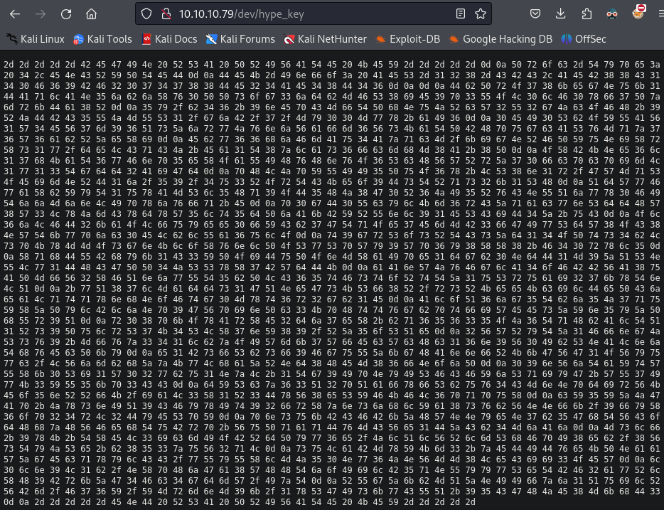

If we decode it, we get a private RSA key
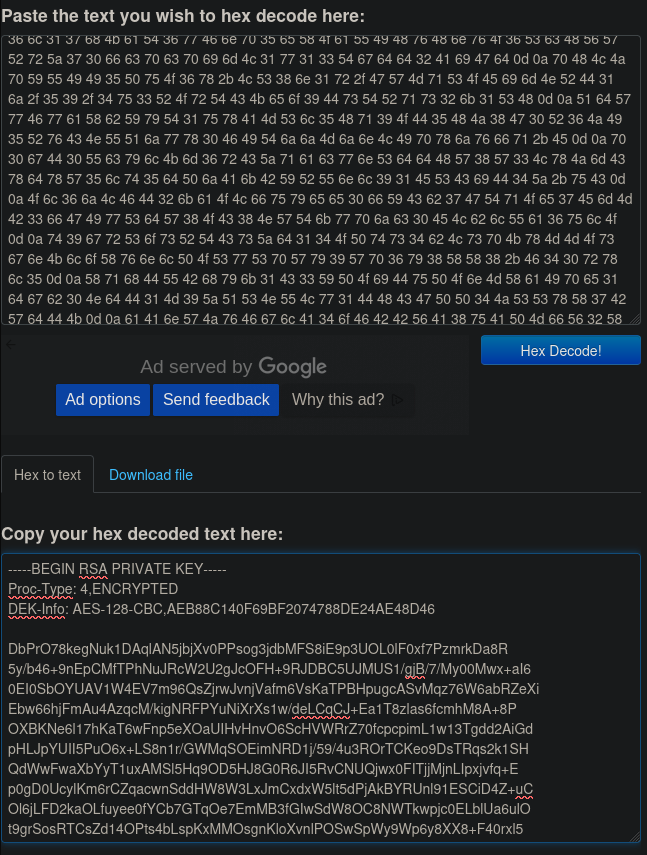

Just save the content inside a file with the same name found in /dev (hype_key)
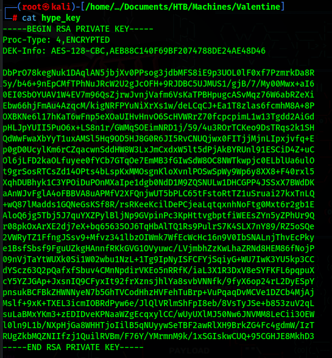

However, this is not enough, because this key is protected with a password.
If we try to ssh into the machine with the user "hype" we get asked for a passphrase
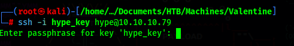

### heartbleed

As we found in the Nmap script scan, this machine is vulnerable to [CVE-2014-0160](https://www.cvedetails.com/cve/CVE-2014-0160/)

We can use metasploit for this
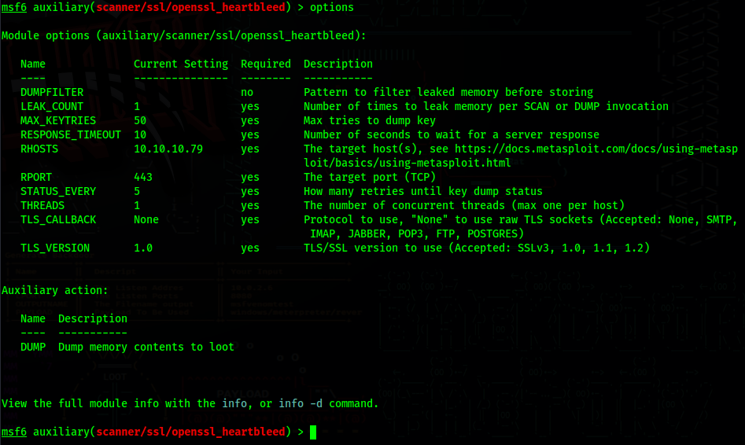

Remember to change action to dump (set action dump)

Now just run the exploit (you might need to run it several times)

Then if we run strings in the dump files, we will eventually come across a base64 encoded string
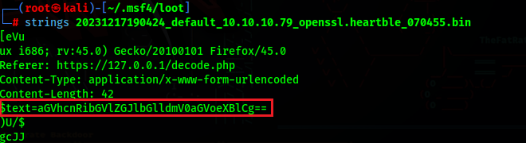
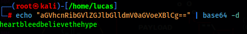
>heartbleedbelievethehype

This is the password for the obtained RSA key

### User Flag

We can now SSH into the machine and get the user flag
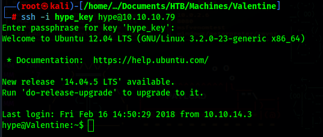
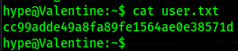

## PrivEsc

### tmux

If we check the commands history for the user hype, we can see that he ran [tmux](https://github.com/tmux/tmux/wiki)
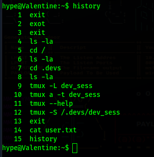

We can just run tmux with the same file he ran it with, and we get root

``` bash
$ tmux -S /.devs/dev_sess
```
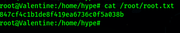